<link rel="stylesheet" href="Resources/Css/Galaxy.css">

# <center>Galaxy Revisited</center>

<center></center>

##### <center>Michael J. Welch, PhD, author and<br/>Tibor Bödecs, technical contributor</center>
<hr/>

> **FIRST DRAFT**

> This is a first draft. The README lacks CSS in the GitHub viewer because GitHub doesn't allow it, but the README will render correctly when viewed locally with a markdown viewer (like Marked2) after cloning the project. In the future, I'll be adding some more stuff (like authentication) to the project, but I wanted to get this up on GitHub so that people could learn from it.

## Contents

<!-- begin contents -->
- [Introduction](#aeababf9-e04d-47e8-9716-0e62caf19260)
- [Developing Galaxy Revisited on a Mac Using Xcode](#f6cb17c7-cf24-453c-846a-46991d815634)
    * [Setting up your Mac](#f160e10e-3418-492f-8f01-839ef9af2f81)
    * [Cloning Galaxy Revisited from GitHub](#d3d0186b-ced6-4856-8b86-a3afac8d8de9)
    * [Building on Xcode](#b8756003-fa48-4203-8abf-b048349670d0)
    * [Is Galaxy Revisited a perfect example of how to write a Swift application?](#9b4e0c23-28cf-4c84-a4d1-5b2519a534f7)
- [The Structure of a Swift-Vapor Web Server](#4ac343ac-7226-491e-a998-6fe3f11b7b3d)
- [Taking a Top-Down Approach](#b697e262-34d1-49ad-b3bf-47397f099256)
    * [All requests are handled in the same way](#acd964bf-49f2-4978-bc0e-1dfadd69e5b3)
- [Writing HTML Using SwiftHtml](#169212cd-5a8c-4188-a99d-a0fd34529d04)
    * [Templates and Contexts](#5d5d3686-d439-4d3b-84c3-e1ee441be6bf)
- [The Fluent Model---GalaxyModel.swift](#444859ab-bbb2-4004-a9c4-1002f11b3be5)
    * [Model Definition](#f31412bb-ddac-4e79-93d2-5da330fd3ed2)
    * [How data is passed between Models and Contexts](#edab8c0b-40ea-4084-86cc-943338b22822)
- [Vapor starts at _main.swift_](#c8c787eb-a4e6-4c9a-a0b4-978fe378b598)
- [The Home page](#5c12f813-336a-4977-8a14-727949b4ae0b)
- [The List All Galaxies Page](#91c02c29-ef1a-4ffa-bad4-bf55e98b6227)
    * [Show-1 Show a Galaxy](#050b0c8e-e579-4d21-b023-815c84d59c1a)
    * [Show-2 Show a Galaxy](#a698c5c7-d668-4918-8673-53e9801a0765)
    * [Show-3 Show a Galaxy](#8632ce4f-59fc-4af5-8408-dc37e97f0ab0)
    * [List Stars](#49699549-3b9f-4ec8-b85e-e944ad53dd00)
    * [Show a galaxy given the UUID](#31517612-5650-4040-8068-a12ef7e27fe5)
    * [Summary of the Show Links and Button](#c4ca2448-cc48-43a9-bd56-38a1ddfcde18)
- [Show a Galaxy Page](#c1b25a9b-e2b7-4357-8192-fcea2cf58b6f)
    * [Update](#75279c44-4cc0-4dc9-85bf-d27b12a568bd)
    * [Delete](#3028b51f-45b7-4abb-b357-474c6ffecd75)
    * [List Stars](#f0b229b1-e89b-4297-9db8-4a4aa776f9aa)
    * [_POST Update_ request using a _form_</a>](#ef8712c5-fcf4-4590-86ff-39e3a482bde8)
    * [_POST Delete_ request using a _form_](#ee8f64fa-2b8d-4624-b1a7-7e3e833dfee1)
    * [_POST Add_ request using a _form_](#470fd552-7859-4aec-ae5c-89d4573a2d92)
- [Add a Star Page](#582e1de9-bd73-446d-93a3-61a231b0f180)
- [List All Stars Page](#c507e1d9-7ddf-41ab-bb64-fc22f3ee11a6)
    * [How to Query a Galaxy and it's Stars](#1c107f53-534b-4836-b1e4-129c1f0c9c36)
- [Show One Star](#1adfc405-a0e6-4d37-a7fd-62e24e9dd641)
- [Testing](#32db6b7a-ffd0-4de7-95f3-a824a739aef2)
    * [A Few Words About Testing](#36973807-3365-43c1-8809-9eab1d4bbfdc)
    * [Testing Links and Buttons on a Page](#f4935ac8-21a6-4d23-ada2-2cdf507b6986)
- [Universally Unique Identifiers (UUIDs)](#3706d5ae-5b59-4465-b9c0-ab729a518055)
- [Data Transfer Objects (DTOs)](#0537ec6b-30bf-4d3d-a84b-6492e321461b)
- [Run Galaxy Revisited on an Amazon Linux 2 Server](#45bf0627-8fc0-4291-8f78-0e8a6dc5b15e)
    * [Start at the Lightsail page](#51fd8a5e-8260-4f98-8f16-ee5eae59b647)
        * [At the `Home` page, click the `Create Instance` button.](#5f61da11-cc42-4918-b52d-a190506d6899)
        * [Creating Keys](#25500332-0d24-406d-b566-e5c4bfe9bb21)
        * [Choosing a Plan](#b8668941-f36e-437f-ab18-e97b04dc2a5c)
        * [Your Instance Is Up And Running](#9b964e3b-8df9-494f-96ac-71ce90b249ed)
        * [Creating a Static IP Address](#b48ec3e7-fa28-4619-b771-1a63a4310afd)
        * [Examining The New Instance](#fa96c869-b543-4e18-8cc9-d647868b86f2)
        * [Setting up the client (your computer's terminal and sshfs)](#51728c3d-b4f8-4d6a-959d-ce7bacc582eb)
    * [MySQL 8 Database Server](#8bc06efc-2f30-425b-a65a-43ed44cb4add)
        * [Start by checking the release of your EC-2 instance](#8d84d5a7-4f39-406d-a102-fe49d12a73bd)
        * [Install the repository](#b7d5f596-df05-44d2-9e0a-65712e00c965)
        * [Install the MySQL package and start the server](#ceaac5ea-c0a3-4e57-aaa8-3bd2bec6867f)
        * [Change the new root password and add a user password for Galaxy Revisited](#02eab657-2444-42c5-9ff8-82e54f662a86)
    * [Installing Swift](#15a71478-a6e2-404c-9f88-1796360f6785)
        * [Downloading Swift](#a43c71aa-1b5c-44b9-bfe1-998260572227)
        * [Finishing the Install](#56bf8150-65e2-4d41-832a-f015d735923e)
        * [Verifying Swift version](#4e5e5b2a-bce6-46cd-96bc-dfae42761300)
    * [Installing Swift Package Manager](#5c86b8d2-6bb8-4ca3-a126-28b7d017e411)
        * [Installing Dependancies](#ef70d3d4-3e4a-4297-8e6e-fe6c883ef85b)
    * [Cloning Galaxy Revisited from GitHub](#5d492dd9-54b0-48ea-9005-6df5cbdda58b)
        * [Building and Running](#7f8f8ca4-2ebd-4a11-ab18-6e8a89ccd0f0)
        * [Accessing From A Browser](#040b70f9-1910-43ec-b622-5cf79890c84f)
        * [Updating Galaxy Revisited on AWS After Initial Installation](#a3e7dac7-6273-4c78-948a-320a95f48a66)
    * [Installing Nginx](#084799b1-400d-4b79-bf89-a2d5ced10c3f)
    * [Running Galaxy Revisited As A Daemon](#150500ab-3243-4a27-9526-61b157769741)
<!-- end contents -->


<!--section-break-section-break-section-break-section-break-section-break-section-break-->


## <a id="aeababf9-e04d-47e8-9716-0e62caf19260">Introduction</a>

The purpose of _Galaxy Revisited_ is to introduce you to most of the basic concepts of Swift-Vapor-Fluent-SwiftHtml programming. Its basic purpose is to jump-start your learning experience with Server Side Swift. Galaxy Revisited was built and tested using macOS Ventura 13.0 and Xcode Version 14.0.

_Galaxy Revisited_ is very basic. It's intended to be used in conjunction with Tibor Bödecs's book [_Practical Server Side Swift_](https://theswiftdev.com/practical-server-side-swift-using-vapor-4-book/) (hereafter PSSS), which goes into many more-advanced topics. You should consider this more like a self-paced tutorial on the _basics_, not an exhaustive treatise on the subject. Once you understand this app, everything else should make more sense.

> **Important**

> This documentation doesn't show the actual source code for the project. You have to clone the project using _git_ and build it using _Xcode_ (see the section below labeled **Cloning Galaxy Revisited from GitHub**). As you read this document, you have to refer to the code in the app to get a full understanding. If you don't clone and build the app, but just read this document, you may learn a few things, but you'll miss so much.

Before going any further, it's important to say that this app (with its documentation) doesn't replace the official [Vapor-Fluent documentation](https://docs.vapor.codes); it clarifies and demonstrates it. My recommendation is to read through the official documentation quickly to get a feel for what's there, but don't dwell on it. Then come here and work with the _Galaxy Revisited_ app to get hands-on experience. After you get the gist of it all, you can use both as reference materials.

Below you can see a diagram of the app's page flow. You can see how simple it is, yet it demonstrates the foundation of every server-side Swift app. It starts with a welcome page; that takes you to the galaxy page which in turn allows you to create, read, update, and delete galaxies... CRUD, as it's commonly referred to. There are two database tables, galaxies, and stars which are used to demonstrate links using UUIDs in a one-to-many relationship (see [the Wikipedia article on UUIDs](https://en.wikipedia.org/wiki/Universally_unique_identifier) for more information).

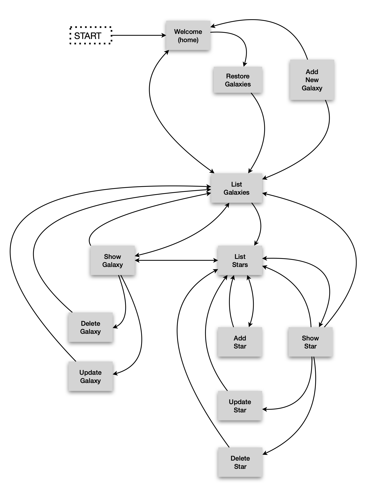

As you experiment with this app, you can save your place using Git (Xcode Menu -> Source Control -> Commit), then if everything goes South, just restore the project and start over. This is a risk-free learning experiment.

Run it and examine the data flow. You can make changes to see what'll happen, and at any time, revert it and start again. Experimentation of this sort is where you learn the most, especially when there's nothing at risk. Note that the chart above doesn't show the _home_ links which you find on every page.

As is common in Vapor-Fluent databases, the tables use a UUID for the primary key. _Galaxy Revisited_ is designed such that the user (nominally) never sees a UUID, but _show_ pages show them just for instructional purposes. In a real application, the UUIDs in the database table are generally used by other tables to reference a record in this one. Normally, _**they would never change**_ because that would break the link between tables.

In _Galaxy Revisited_, however, whenever the database is restored to its nominal content, or a test is run, the database data is erased and replaced with fresh, new data in which all the UUIDs are also new. This ability is useful for testing, where you want to be able to have non-repeatable data to discover errors caused by stale data. In a real app, the test database and the production database would be separate, but in _Galaxy Revisited_ no effort has been made to make them so. Here's an area you could experiment with.

> **Warning**

> You can't meaningfully sort on a UUID because they are (nominally) random. You may want to consider adding an integer key to the table which is automatically incremented which you can use for sorting by insertion order. Otherwise, there is no practical way to pick up the _first_ or _last_ record by order of insertion or return a series of records in insertion order.

> Also, remember that _first_ in a Fluent query means _the first record found which meets the search criteria_, not the first record inserted into the table (although it may coincidentally be the same record). MySQL and some other databases _do not guarantee_ that records will be returned in any particular order without an _ORDER_ clause. Hic sunt dracones.

> In one post, the poster also pointed out that you need a sequential number in insertion order to be able to pick up the _prior_ and the _following_ records by subtracting 1 or adding 1 to the sequential key value. The flaw here is that if you have records A, B, C, D, and E, and you read record C, the technique will work to read records B and D, but if for some reason record B or D gets deleted, the method will fail with a _record not found_. Oops, back to the drawing board!

> The only reliable way of reading the table in reverse insertion order is to sort it by insertion order descending or keep two insertion keys, one ascending and one descending. For the example above, you'd need two queries to accomplish this. These and any other techniques for retrieving records in reverse order of insertion are the least-worst solutions (unfortunately). The best solution is to design software that doesn't rely on reading tables in reverse order of insertion.

[back to contents](#contents)<hr/>

<!--section-break-section-break-section-break-section-break-section-break-section-break-->


## <a id="f6cb17c7-cf24-453c-846a-46991d815634">Developing Galaxy Revisited on a Mac Using Xcode</a>

### <a id="f160e10e-3418-492f-8f01-839ef9af2f81">Setting up your Mac</a>

This project was designed to be developed on a Mac computer and deployed on an Amazon AWS EC2 instance using an Amazon Linux2 Server. If you don't have that setup, you can still use this document, but you'll have to figure out the differences between what you have and our suggested setup.

The project documentation is comprised largely of two sections, development on a Mac with Xcode, and production (deployment) on an Amazon AWS EC2 server. The good news is that almost any Linux will work fine, but keep in mind that there are two ancestors to most Linux systems, RedHat and Debian. There will be small differences between them; for example, RedHat uses _yum_ and Debian uses _apt_. If you are experienced with Linux, you probably already know the differences and will have no trouble.

Also, you can develop on the Linux system; it's just far less convenient and will cost you much more time. If you have a significant project, you will be well served by buying a Mac for Xcode development. It'll be much easier, save lots of time, and, most importantly, be more fun.

### <a id="d3d0186b-ced6-4856-8b86-a3afac8d8de9">Cloning Galaxy Revisited from GitHub</a>

You can find [_Galaxy Revisited_ on GitHub](https://github.com/mjwelchphd/GalaxyRevisited).

Click the green _Code_ button, and from the dropdown, click the copy icon .

Open a terminal window on your Mac, and _cd_ to the place where you want the project to go. Enter:

```script
git clone ⌘v
cd GalaxyRevisited
ls -hAlt
```

You should get:

```script
total 320
drwxr-xr-x  12 mike  staff   384B Nov  9 19:19 .git
-rw-r--r--   1 mike  staff   1.8K Nov  9 19:19 docker-compose.yml
drwxr-xr-x   3 mike  staff    96B Nov  9 19:19 Tests
drwxr-xr-x   4 mike  staff   128B Nov  9 19:19 Sources
drwxr-xr-x   4 mike  staff   128B Nov  9 19:19 Resources
-rw-r--r--   1 mike  staff    98K Nov  9 19:19 README.md
drwxr-xr-x   5 mike  staff   160B Nov  9 19:19 Public
-rw-r--r--   1 mike  staff   1.3K Nov  9 19:19 Package.swift
-rw-r--r--   1 mike  staff   7.2K Nov  9 19:19 Package.resolved
-rw-r--r--   1 mike  staff    34K Nov  9 19:19 LICENSE
-rw-r--r--   1 mike  staff   2.6K Nov  9 19:19 Dockerfile
-rw-r--r--   1 mike  staff    97B Nov  9 19:19 .gitignore
```

### <a id="b8756003-fa48-4203-8abf-b048349670d0">Building on Xcode</a>

Double-click the _Package.swift_ icon. The project will open in Xcode. Click GalaxyRevisited in the navigator pane, and the Package.swift file should open.

> **Important**

> Click the schema editor dropdown menu  and select _Edit Scheme_. In the scheme edit window, select _Run_ on the left-hand side, and _Options_ at the top bar. Go down to _Working Directory_ and check _Use custom working directory_, and select the _GalaxyRevisited_ project folder. Repeat this for _Profile_. If you don't do this, some resources won't be found when you run the app.


Click in the editor window, then type ```⌘U``` and the project will build and tests will run. This took less than 30 seconds the first time. After the first time, it takes only a few seconds.

You should see the _Build Succeeded_ and _Test Succeeded_ windows pop up one at a time on the screen.

Open the _output_ window at the bottom right of the Xcode editor window , then type the Run command ```⌘R``` or click the run button  and if the _Developer Tools Access_ dialog opens, enter your login password and click _continue_, then you should see:

```script
[ NOTICE ] Server starting on http://127.0.0.1:8080
```

in the _output_ window. To test the app, run your browser and enter:

```script
http://localhost:8080/
```

and the welcome page should be displayed.

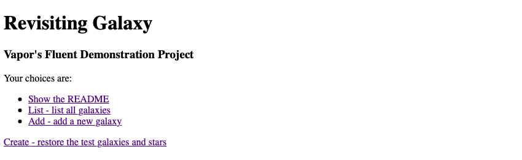

To stop the execution, click the _stop_ button .

<!--section-break-section-break-section-break-section-break-section-break-section-break-->


### <a id="9b4e0c23-28cf-4c84-a4d1-5b2519a534f7">Is Galaxy Revisited a perfect example of how to write a Swift application?</a>

_**No, sorry**_. There must be plenty of places where improvements can be made, and if you find one, give it a try! I haven't been entirely consistent in my naming conventions, either. As we programmers like to say, "I'll do it better next time!" (Shame on me for that one.) That's what this app is for. Learning and experimenting without risk.

As I was programming the tests (and that turned out to be more code than I anticipated), I found that I was starting to cut corners to save work, and the quality of what I was doing was dropping dramatically. There are some sayings among writers:

- If the stuff you're writing isn't for yourself, it won't work. --- Stephen King
- Only bad writers think that their work is really good. --- Anne Enright
- Writing is thinking and thinking is hard work. --- Lewis Black
- Writing isn't glamorous --- it's hard work. If you want to be a glamorous writer, wear purple nail varnish when you type. --- Sue Cross

This applies to writing Swift also. Good code has several characteristics:

- The most important characteristic is _reliability_; it must always work as expected. This may seem obvious, but it's easy to overlook places where unexpected errors can occur, and it often involves nil-optionals and throws. Careful design up-front can reduce this problem. Try making a small change to your code that you know will cause a failure, such as passing a UUID for which there is no database record, then see if the error gets caught. This can be put into a _test_, although there is none in Galaxy Revisited. Try Adding a test like that.

- Simplicity is the next important characteristic, and this usually brings to mind Occam's Razor, which is simply: the simplest solution is usually the best. Crafting code that uses the full power of Swift can lead to simpler, more expressive, code.

- Maintainability is next. Code must be crafted to make it easy to follow, but good code alone isn't good enough: you need good comments in the code also. For that, there are many style guides you can refer to listed below.

- Lastly, we used to think that _small, fast_ code was the goal, but that was back in the day when a giant mainframe had only _one-megabyte_ of core memory, instruction times were measured in _microseconds_, and the computer required a small building to house it, and an electrical power station nearby (I worked on one of these: I'm thinking of you, IBM/360). Today computers have thousands of times that much memory and instruction cycle times are measured in fractions of _nanoseconds_, and an Apple Macbook M1 uses only about 8-15 watts of power. Today, the goal is _reliable and maintainable_ code. Small and fast are the jobs of the compiler (and Swift does it _so_ well).

Some of the many guidelines available can be found here:

- [Conventions for Xcode](https://theswiftdev.com/conventions-for-xcode/)
- [Swift API Design Guidelines](https://swift.org/documentation/api-design-guidelines/)
- [Ray Wenderlich's Swift Style Guide](https://github.com/raywenderlich/swift-style-guide)
- [Linkedin's Swift Style Guide](https://github.com/linkedin/swift-style-guide)
- [AirBNB's Swift Style Guide](https://github.com/airbnb/swift)
- [Vadim Bulavin's The Art Commenting](https://www.vadimbulavin.com/the-art-of-commenting-in-swift/)
- [Vadim Bulavin's Style Guide](https://www.vadimbulavin.com/swift-code-style/)
- [Apple's API Design Guidelines](https://www.swift.org/documentation/api-design-guidelines/)
- [Google's Swift Style Guide](https://google.github.io/swift/)
- [Apple's Formatting Your Documentation Content](https://developer.apple.com/documentation/xcode/formatting-your-documentation-content)

Now, after this long exhortation, I have to admit that I deliberately violated the rules in one situation. This code:

```swift
try app.test(.POST, "/galaxy/delete", beforeRequest: { req in
    var galaxyIdContext = GalaxyIdContext()
    galaxyIdContext.galaxyId = smallMagenicCloudUuid
    try req.content.encode(galaxyIdContext, as: .urlEncodedForm)
}, afterResponse: { res in
    XCTAssertEqual(res.status, .seeOther)
})
```

looks better this way:

```swift
try app.test(.POST, "/galaxy/delete",
    beforeRequest: { req in
        var galaxyIdContext = GalaxyIdContext()
        galaxyIdContext.galaxyId = smallMagenicCloudUuid
        try req.content.encode(galaxyIdContext, as: .urlEncodedForm)
    },
    afterResponse: { res in
        XCTAssertEqual(res.status, .seeOther)
    }
)
```

Notice that the closures, beforeRequest and afterResponse, can more easily be visualized as independent blocks of code.

The bottom line is that a generic set of rules can't cover every possible case, and you'll just have to use your judgment in some situations, but remember, if you reformat this code using \<ctrl>i, you'll get this ugly and difficult to read code (which follows the rules):

```swift
try app.test(.POST, "/galaxy/delete",
             beforeRequest: { req in
    var galaxyIdContext = GalaxyIdContext()
    galaxyIdContext.galaxyId = smallMagenicCloudUuid
    try req.content.encode(galaxyIdContext, as: .urlEncodedForm)
},
             afterResponse: { res in
    XCTAssertEqual(res.status, .seeOther)
}
)
```

I realized that I had to go back and do better. It's called crafting. Writers call it wordsmithing. The lesson here? Learn and follow the guidelines to make yourself a better Swift programmer, but keep it sane.

[back to contents](#contents)<hr/>


<!--section-break-section-break-section-break-section-break-section-break-section-break-->


## <a id="4ac343ac-7226-491e-a998-6fe3f11b7b3d">The Structure of a Swift-Vapor Web Server</a>

Vapor uses a common structure for developing a server-side app that's close to the default structure of a default (non-Vapor) Swift project that the _swift_ tool creates. Also, if you create a project with the _vapor_ tool, it follows this pattern, but with some minor differences. In addition, there are some minor differences to accommodate the programming style you find in _Galaxy Revisited_ and PSSS.

This structure divides the code and other files into separate _areas of concern_. These areas are similarly divided into other sub-areas, and all of this serves to bring a high level of organization to the project which makes the project easier to write and maintain. Notice that each controller is similar: it shows how a logical organization enables patterns to be used to organize the source.

When you organize your code this way, you'll find that you spend most of your time in just a few folders, maybe Controllers and Templates, for example. Everything else is mostly static, and since the other code is physically separated, the chance of accidentally modifying it is very low.

This style would be considered a model-view-controller (MVC) style, but Galaxy Revisited isn't tightly bound to that style and considers MVC to be more of a _suggested pattern_ of design. Do what's best for your project; don't manipulate your code to comply with a style strictly for the sake of compliance. Think pragmatically.

A big difference you'll see in _Galaxy Revisited_ is the use of DTOs or Data Transfer Objects (see the [section on DTOs](#0537ec6b-30bf-4d3d-a84b-6492e321461b) for more information); here we refer to them as _contexts_.

The project folder for _Galaxy Revisited_ looks like this:

```diagram
Project Folder
├── Public                          Runtime files
├── Resources                       The database, CSS, and images
├── Sources
│   ├── App
│   │   ├── Extensions              Application-wide extensions
│   │   ├── Modules                 The all controller source code
│   │   │   ├── Galaxy              The Galaxy controller source code
│   │   │   │   ├── Controllers     The controller endpoints
│   │   │   │   ├── Migrations      Fluent migration code here
│   │   │   │   ├── Models          The Fluent model(s)
│   │   │   │   └── Templates
│   │   │   │       ├── Contexts    All DTOs (contexts)
│   │   │   │       └── Html        All SwiftHtml modules go here
│   │   │   ├── Star                The collection of Star source code
│   │   │   │   ├── Controllers     Same breakdown as Galaxy
│   │   │   │   ├── Migrations
│   │   │   │   ├── Models
│   │   │   │   └── Templates
│   │   │   │       ├── Contexts
│   │   │   │       └── Html
│   │   │   └── Welcome
│   │   │       ├── Controllers     Same breakdown as Galaxy
│   │   │       └── Templates
│   │   │           └── Html
│   │   ├── Protocols               Application-wide protocols
│   │   └── Template                Tibor Bödecs's handy template helpers
│   └── Run                         Startup code
└── Tests
    └── AppTests                    All test-related materials are here
```

[back to contents](#contents)<hr/>


<!--section-break-section-break-section-break-section-break-section-break-section-break-->


## <a id="b697e262-34d1-49ad-b3bf-47397f099256">Taking a Top-Down Approach</a>

_Galaxy Revisited_ takes a top-down and visually oriented approach as much as possible. This approach is suitable for auditory-sequential learners, but it's especially important for visual-spatial learners who need to see the big picture before the nitty-gritty details. So, we start at the top and work our way through somewhat like a user might try out the app. As we go through the pages, we'll explore the coding techniques needed to implement Vapor-Fluent-SwiftHtml apps. This method is referred to as [_Ariadne's thread_](https://en.wikipedia.org/wiki/Ariadne%27s_thread_(logic)) in logic and it's thusly applied to programming.

The project structure in the _Xcode navigator_ is decidedly not top-down, but alphabetical because Xcode sorts all the folders and files in alphabetical order. The _Galaxy Map_ is a much better way to visualize the top-down flow of the app. This flow will be followed to some degree here; we'll take a look at different concepts in the order they come up, taking into account that many of the techniques appear repeatedly, so we only need to discuss them once.

[back to contents](#contents)<hr/>


<!--section-break-section-break-section-break-section-break-section-break-section-break-->


### <a id="acd964bf-49f2-4978-bc0e-1dfadd69e5b3">All requests are handled in the same way</a>

All requests in controllers begin with a _Request_ object. They mostly follow the pattern

- decode inputs from the previous page (if any);
- lookup data in the database (if needed);
- other specific logic creating a _context_ or _DTO_;
- prepare the return data:
    * fill out and render a template to return; or
    * do another operation like _update_, then prepare a redirect; and
- return.

```swift
func endPoint(_ req: Request) async throws -> Response {
    <handle the request, creating a response>
    return <Response>
}
```

[back to contents](#contents)<hr/>


<!--section-break-section-break-section-break-section-break-section-break-section-break-->


## <a id="169212cd-5a8c-4188-a99d-a0fd34529d04">Writing HTML Using SwiftHtml</a>

GalaxyRevisited renders HTML docs using a brand new domain-specific library (DSL) called SwiftHtml and the Vapor web framework. The code is pretty straightforward, especially if you know a bit about HTML. The SwiftHtml library tries to follow the naming conventions as closely as possible, so if you've written HTML before this syntax should be very familiar, except that you don't have to write opening and closing tags: instead, we utilize the Swift compiler to do the boring repetitive tasks for us.

Since we're using a DSL in Swift, the compiler can type-check everything at build-time: this way it's 100% sure that our HTML code won't have syntax issues. Of course, you can still make semantic mistakes, but that's also possible if you're not using a DSL.

The main advantage here is that you won't be able to mistype or misspell tags, and you don't even have to think about closing tags, but you can use result builders to construct the HTML node tree. SwiftHtml uses _Tags_ for nodes and it builds a tree from them; this makes it possible to efficiently render the entire structure with proper indentation, or minification if needed.

For an in-depth tutorial, look at [How to write HTML in Swift?](https://theswiftdev.com/how-to-write-html-in-swift/)

Here's an example of SwiftHtml showing a form inside a table, and inside the form, a hidden input field and button. In the case of a button, the button takes the place of an input+submit, and thus allows for multiple buttons in the same form, each with a different destination URL.

Note that:

- Tags begin with a capital letter, like _Form {...}_.
- Tags may be nested, like _Form { Tr {...} }_.
- Tags may have content, like _Button("Show-3")_.
- Attribute names are lowercase, like _.type(.text)_.
- Tags may have attributes, like _.name("show-3-submit")_.
- Attributes may have values, like _.formmethod(.get)_.
<br/>

```swift
Table {
	Tr {
		Td {
			Form {
				Input()
					.type(.hidden)
					.name("galaxyId")
					.value(galaxyContext.galaxyId)
				Button("Show-3")
					.type(.submit)
					.name("show-3-submit")
					.formaction("/galaxy/show2")
					.formmethod(.get)
					.formenctype(.urlencoded)
			}.name("show-3-form")
		}
	}.style("background-color: #F0F0FF")
}
```

This will generate HTML that looks like this:

```html
<table>
    <tr style="background-color: #F0F0FF">
        <td>
            <form name="show-3-form">
                <input type="hidden" name="galaxyId" value="35B56F32-D794-430F-B6AD-1FEF5535684E">
                <button type="submit" name="show-3-submit" formaction="/galaxy/show2" formmethod="get" formenctype="application/x-www-form-urlencoded">Show-3</button>
            </form>
        </td>
    </tr>
 </table>
```

Notice that the input button properties match the listing in the [W^3^C page](https://www.w3schools.com/tags/tag_button.asp), with the exception that enums are preceded by a period as required by Swift syntax.


[back to contents](#contents)<hr/>


<!--section-break-section-break-section-break-section-break-section-break-section-break-->


### <a id="5d5d3686-d439-4d3b-84c3-e1ee441be6bf">Templates and Contexts</a>

Vapor-SwiftHtml templates are very simple to build. Here's an example of a template:

```swift
var galaxiesContext: GalaxiesContext

init(_ galaxiesContext: GalaxiesContext) {
    self.galaxiesContext = galaxiesContext
}

@TagBuilder
func render(_ req: Request) -> Tag {
    Html {
        Head {
            ...
        }
        Body {
            ...
        }
    }.lang("en-US")
}
```

and its contexts.

```swift
struct GalaxiesContext {
    var galaxies: [GalaxyContext]
    ...
}

struct GalaxyContext: Content {
    var galaxyId: String = ""
    var name: String = ""
    var magnitude: Float = 0.0
    var distance: Int = 0
    var constellation: String = ""
    ...
}
```

The _var galaxiesContext_ will hold the context, i.e., the data to render in the template. That _var_ gets filled in the _init_ function.

@TagBuilder identifies this as a SwiftHtml DSL builder that returns a _Tag_. The Html, Body, H1, Table, Tr, Th, Td, A, Form, Input, Button, and Br statements follow the same pattern: they are the capitalized name of the HTML tag, and they have the same attributes as the tag definitions in the W^3^C HTML specification.

Here's an _a_ tag example.

```swift
A("Show").name("show-link").href("/galaxy/show?galaxyId=\(galaxyContext.galaxyId)")
```

generates:

```html
<a name="show-link" href="/galaxy/show?galaxyId=C666C717-319F-48A2-B80D-93CF2E055B4C">Show</a>
```

The sharp eye might have noticed that the _a_ tag has a _name_ attribute that's not supported in the W^3^C specifications. Spoiler alert: it's for testing. We'll get to that in the chapter on testing.

Here's another example.

```swift
Form {
    Input().type(.hidden).name("galaxyId").value(galaxyContext.galaxyId)
    Button("Show").name("show-submit").type(.submit)
        .formaction("/galaxy/show")
        .formmethod(.get).formenctype(.urlencoded)
}.name("show-form")
```

> **Beware**

> If the tag has a body, the attributes must follow the body; for example, the _.name("show-form")_ follows the closing bracket of the _Form_ in the example.

The HTML produced is:

```html
<form name="show-form">
    <input type="hidden" name="galaxyId" value="C666C717-319F-48A2-B80D-93CF2E055B4C">
    <button name="show-submit" type="submit" formaction="/galaxy/show" formmethod="get"
    	formenctype="application/x-www-form-urlencoded">Show</button>
</form>
```

[back to contents](#contents)<hr/>


<!--section-break-section-break-section-break-section-break-section-break-section-break-->


## <a id="444859ab-bbb2-4004-a9c4-1002f11b3be5">The Fluent Model---GalaxyModel.swift</a>

The Vapor-Fluent Model is just a definition of what the database object (or _table_ in relational databases like Sqlite) looks like. Notice the use of _Swift properties_ in the definitions. Don't worry about how Swift properties work: just follow the pattern.

### <a id="f31412bb-ddac-4e79-93d2-5da330fd3ed2">Model Definition</a>

- The _schema_ value is the name of the database table in the database.
- @ID
	* defines the _primary_ key in the table. The default creates a _UUID_ key, but you can use another type if you need to.
- @Field
	* defines the name of the field in the database, and the name and type of the field in the application. This is important because a field named _firstName_ in your app will have the name _first\_name_ in a PostgreSQL database.
- @Parent
	* defines a _foreign key_ for a child table to hold the primary key of the parent table.
- @Children
	* defines one or more tables that reference this table as the parent. No actual field is created in the database table: this statement is used to create information for Fluent.

In the @Field definition, it appears that field names are repeated, but there is a reason for the apparent duplicity. Take this field definition, for example.

```swift
@Field(key: "constellation_name") var constellationName: String
```

This says that, in the database, the column name in the table is _constellation_name_, but in the Swift app, the name is _constellationName_. PostgreSQL, for example, uses _all lowercase letters in a field name_ whereas your app must conform to Swift naming rules and styles. This is the way Vapor allows for compatibility between Swift and your database. This feature can also be used to gain compatibility with legacy databases.

In migrations, it's the first name, _constellation_name_ which will be used in the database.

Fluent requires an empty _init(&nbsp;) { }_ function.

### <a id="edab8c0b-40ea-4084-86cc-943338b22822">How data is passed between Models and Contexts</a>

As I mentioned earlier, data is transferred in and out of models through DTOs. Let's see how that works. (The _try awaits_ and _guards_ were removed for clarity.)

Data is transferred into GalaxyModel from GalaxyContext for one of two reasons:

- to initialize the model before writing a new record:

```swift
galaxyModel = GalaxyModel(new: galaxyContext)
```
 or
 
- to initialize the model before updating an existing record:

```swift
galaxyModel.update(update: galaxyContext)
```

You may be wondering why there is an _init(new:...)_, but a _func update(update:...)_; it's because _init_ creates a new instance whereas _update_ acts on an existing instance.

The difference is that _GalaxyModel(new:)_ sets the _id_ to _nil_ to signal to Fluent that this
 is a new record to be added to the database.
 
 The GalaxyModel can be initialized by reading from the database, also. In this case, the data is moved to the GalaxyContext for one of two reasons:
 
 - to pass a list of galaxies:
 
 ```swift
 GalaxiesContext(many: GalaxyModel.query(on: req.db).all())
 ```
 
 or
 
 - to pass a single galaxy:
 
 ```swift
 GalaxyContext(model: GalaxyModel.find(galaxyId, on: req.db))
 ```
 
**One More Thing...**

GalaxiesContext is just an array of GalaxyContexts. Notice that there is another _init_ for GalaxiesContext_ that allows for a single galaxy:
 
 ```swift
 GalaxiesContext(one: GalaxyModel.query(on: req.db).first())
 ```
 
 This particular function didn't get used, but I left it in anyways.

[back to contents](#contents)<hr/>


<!--section-break-section-break-section-break-section-break-section-break-section-break-->


## <a id="c8c787eb-a4e6-4c9a-a0b4-978fe378b598">Vapor starts at _main.swift_</a>

Although the app "starts" here, in reality, the Swift code just sets up the Vapor environment and starts Vapor. Once Vapor is running, it listens for connections and handles requests. As part of the configuration process, this code calls _configure.swift_, and that opens the database, runs the migration, and initializes the routes tables.

Main starts by calling _configure.swift_, and that opens the database first. If there isn't a database, and you're using _sqlite_, it will create it. If you're using MySQL, you have to do that yourself manually using MySQL utilities (see [how it's done on AWS](#8bc06efc-2f30-425b-a65a-43ed44cb4add)). If the database gets created during the initial startup of _Galaxy Revisited_, it won't have any tables in it. Those will get created during the migration process, but they'll be empty tables.

There are two migrations, one for _galaxies_ and the other for _stars_. Note that migrations are run in the order they are defined, _galaxies_ first, then _stars_ because when creating the stars, the galaxies (the parents) must already be present. That's evident in _createUniverses.swift_. Having a set of starting data makes it easier to jump right in and start learning.

That means that the very first time _Galaxy Revisited_ is run (before the database exists), you have to select _Create - restore the test galaxies and stars_ on the home page (unless, by chance you run the tests first, in which case the tests did the _Create_ function). If you want to use another database such as PostgreSQL or MySql, you may have other things you'll have to do to set up the database that is beyond the scope of this book.

The last thing _configure_ does is load the routes, and after that, Vapor waits for requests. To see the main (Welcome) page, you have to start the app running in Xcode and enter the URL _http://localhost:8080/_ into your browser. From there, you can follow links all around the app.

[back to contents](#contents)<hr/>


<!--section-break-section-break-section-break-section-break-section-break-section-break-->


## <a id="5c12f813-336a-4977-8a14-727949b4ae0b">The Home page</a>

Once you have the app running, use your browser to go to http://localhost:8080/; the first page that comes up is the Home page from the WelcomeController which looks like this:


!TODO update image to show the readme line

The very first time you run the app, choose _Create - restore the test galaxies and stars_ to initialize the database with test data. After the database is initialized (or re-initialized), you'll be left at the _List - list all galaxies_ page. Seven galaxies are created, each with some stars. Anytime you want to come back to this state, just click on the _Create_ link on the Home page again.

The _Home_ page, a.k.a. the _Welcome_ page, has three links:

- List - list all galaxies
    * This takes you to the list all galaxies page you arrived at after the _Create_ link or the _List_ link. The most important function of the _List - list all galaxies_ page is that (internally) galaxy names are associated with each galaxy's key (a UUID, Universal Unique Identifier). When you select a galaxy _Show_ link or button, or the _Show Stars_ button, the galaxy's UUID is passed on to the next page.

> **Important Tip**

> UUIDs are used to identify one object from another _uniquely_. You can enter the same galaxy twice in the app, but behind the scenes, each will have a unique UUID. UUIDs are important for that very reason: each object must be uniquely identifiable. Be aware: each time you click the _Create - restore the test galaxies and stars_ link you'll get all new UUIDs because all the data is deleted first, then new galaxies and stars are added back in. **In normal apps, you don't recreate data like this**: database records, once created, are permanent and their UUIDs are permanent (unless you deliberately delete them).

> One other thing: macOS UUIDs created by Swift, Vapor, and Fluent are all uppercase even though the UUID specifications call for lowercase. Just note that when the String form of an upper-case UUID it's compared with its lower-case form, it should be obvious that an _exact_ comparison will fail, but a case-insensitive comparison would pass. In some applications, the case may not matter (because they use case-insensitive comparisons), but the safest path to follow with macOS is to make _all_ UUIDs uppercase, even if they weren't created by Swift, Vapor, or Fluent. Consistency in the treatment of UUIDs will be rewarded.

- Add - add a new galaxy

    * All the _Add_ link does is bring up a page into which you can enter a new galaxy.

- Create - restore the test galaxies and stars

    * (We saw this up above.)

To continue, click the _List - list all galaxies_ link to go to the next page.

[back to contents](#contents)<hr/>


<!--section-break-section-break-section-break-section-break-section-break-section-break-->


## <a id="91c02c29-ef1a-4ffa-bad4-bf55e98b6227">The List All Galaxies Page</a>

This page demonstrates how to pass parameters in a GET call. There are three ways to pass a parameter:

- by including it as part of the URL in a _link_;
- by adding it to the URL as a _query_ in a _link_;
- by adding it to the URL as a _query_ in a _button_.

HTML4 only supported a single submit button for a form and a single _action_. HTML5 added a _button_ (which acts like an _\<input type=submit>_) to forms. The _formaction_ attribute in a button can specify a different _action_ for each button, thus allowing the same form to be sent to different endpoints. The _Show-3_ and _List Stars_ forms use buttons.


### <a id="050b0c8e-e579-4d21-b023-815c84d59c1a">Show-1 Show a Galaxy</a>

The _Show-1_ link transfers to the _Show a Galaxy Page_. It demonstrates how to pass a parameter through a URL and is the first of three different ways to pass one or more parameters in a GET request by including them in the URL. An example of a UUID passed through a URL (where the parameter is highlighted) is:

<monospace>
http://localhost:8080/galaxy/show1<yellow-highlight>/1E3E85B9-7C17-4BAA-A2F8-2C67B73CDC10</yellow-highlight>/
</monospace>

The SwiftHtml coding in _GalaxyIndexTemplate.swift_ is:

```swift
A("Show-1").name("show-1-link").href("/galaxy/show1/\(galaxyContext.galaxyId)")
```

and generates this HTML:

```html
<a name="show-1-link" href="/galaxy/show1/1E3E85B9-7C17-4BAA-A2F8-2C67B73CDC10">Show-1</a>
```

where the UUID 1E3E85B9-7C17-4BAA-A2F8-2C67B73CDC10 was read from the database in _/galaxy/index/_. 

> _**Important Tip:** SwiftHtml "A" Tag Needs To Be Extended_

> As mentioned before, the \<a> tag doesn't have a _name_ attribute, but we'll need one for testing. Since it's not part of the W^3^C specification, SwiftHtml doesn't accept it. To get around this, we _extend_ SwiftHtml in _SwiftHtmlTags.swift_. Some Ruby programmers call this _monkey patching_, but it's a feature of Ruby, not a bug. In Swift, it's an _important_ feature that you'll find useful in many situations, and it's used extensively by Swift programmers.

When you click the Show-1 link in the browser, Vapor receives the request and looks for the URL __/galaxy/show1/:galaxyId__ in the routing tables, then calls func show1(&nbsp;) in GalaxyController.

_Show-1_ link gets defined in the _routes_ table like this:

```swift
galaxyRoutes.get("show1", ":galaxyId", use: show1)  // maps: "/galaxy/show/<galaxyId>"
```

You can see the value _1E3E85B9-7C17-4BAA-A2F8-2C67B73CDC10_ in the GET request that will get decoded by Vapor into the _parameters_.

At _func show1(...)_ the incoming GET request gets processed and stored in the request like this:

```script
RoutingKit.Parameters(
  values: ["galaxyId": "1E3E85B9-7C17-4BAA-A2F8-2C67B73CDC10"],
  catchall: RoutingKit.Parameters.(unknown context at $100ff480c)
  .Catchall(values: [], isPercentEncoded: true), logger: Logging.Logger(
  handler: ConsoleKit.ConsoleLogger(
  label: "routing-kit-parameters-logger", metadata: [:], logLevel: info, 
  console: ConsoleKit.Terminal), label: "routing-kit-parameters-logger"))
```

The _func showGalaxy_ is common for the three _show_ buttons. It completes the _show_ operation given the _galaxyId_.


### <a id="a698c5c7-d668-4918-8673-53e9801a0765">Show-2 Show a Galaxy</a>

The _Show-2_ link transfers to the _Show a Galaxy Page_. It demonstrates how to pass a parameter through a URL _query_ and is the second of three different ways to pass one or more parameters in a GET request by including them in the URL query. An example of a UUID passed through a URL query (where the parameter is highlighted) is:

<monospace>http://localhost:8080/galaxy/show2<yellow-highlight>?galaxyId=1E3E85B9-7C17-4BAA-A2F8-2C67B73CDC10</yellow-highlight>/</monospace>

The SwiftHtml coding is:

```swift
A("Show-2").name("show-2-link").href("/galaxy/show2?galaxyId=\(galaxyContext.galaxyId)")
```
and generates:

```html
	<a name="show-2-link" href="/galaxy/show2?galaxyId=1E3E85B9-7C17-4BAA-A2F8-2C67B73CDC10">Show-2</a>
```

Again, the UUID is passed in the URL, but not as a part of the URL proper, but as a query string following the "?" and is decoded differently.

When Vapor gets this, it decodes the request into _req.query_ and we pick it up using _req.query.decode(GalaxyIdContext.self)_. Note that queries passed as part of the URL are decoded into _query_ and must be decoded into a _context_, rather than directly into a _var_.

```swift
galaxyIdContext = try? req.query.decode(GalaxyIdContext.self)
guard ...
... galaxyIdContext.galaxyId
```


### <a id="8632ce4f-59fc-4af5-8408-dc37e97f0ab0">Show-3 Show a Galaxy</a>

The _Show-3_ button transfers to the _Show a Galaxy Page_. It demonstrates another way to pass a parameter through a URL _query_ and is the third of three different ways to pass one or more parameters in a GET request by including them in the URL query. An example of a UUID passed through a URL query (where the parameter is highlighted) is the same as the Show-2 link, but using a button:

<monospace>http://localhost:8080/galaxy/show2<yellow-highlight>?galaxyId=1E3E85B9-7C17-4BAA-A2F8-2C67B73CDC10</yellow-highlight>/</monospace>
    
The SwiftHtml coding is:

```swift
Form {
	Input().type(.hidden).name("galaxyId").value(galaxyContext.galaxyId)
	Button("Show-3").name("show-3-submit").type(.submit)
		.formaction("/galaxy/show2")
        .formmethod(.get)
        .formenctype(.urlencoded)
}.name("show-3-form")
```

and generates:

```html
<form name="show-3-form">
	<input type="hidden" name="galaxyId" value="1E3E85B9-7C17-4BAA-A2F8-2C67B73CDC10">
	<button name="show-3-submit" type="submit" formaction="/galaxy/show2" formmethod="get"
		formenctype="application/x-www-form-urlencoded">Show-3</button>
</form>
```

When Vapor gets this, it decodes the request into _req.query_ and we pick it up using _req.query.decode(GalaxyIdContext.self)_. Note that queries passed as part of the URL are decoded into _query_ and must be decoded into a _context_, rather than directly into a _var_.

```swift
let galaxyIdContext = try req.query.decode(GalaxyIdContext.self)
let galaxyId = UUID(galaxyIdContext.galaxyId)!
```

The astute reader will have noticed that the URL links to _/galaxy/show2_ which is the same as the _show-2_ link. The reason is that the _show-3_ form/button produces a query identical to the _show-2_ query, which means that it can be decoded by the same (Show-2) code.

When Vapor gets this, it decodes the request into _req.query_ just as was done for the _show-2_ link. We use it accordingly.

### <a id="49699549-3b9f-4ec8-b85e-e944ad53dd00">List Stars</a>

The _List Stars_ button transfers to the _List All Stars Page_. It demonstrates the way to pass multiple parameters through a URL _query_ and works in a way similar to the way the _Show-3_ button works, but has more parameters and transfers to _show/index_.
    
The SwiftHtml coding is:

```swift
Form {
    // send a StarIdContext.swift
    Input().type(.hidden).name("galaxyId").value(galaxyContext.galaxyId)
    Input().type(.hidden).name("galaxyName").value(galaxyContext.name)
    Input().type(.hidden).name("starId").value("")
    Button("List Stars")
        .type(.submit)
        .name("show-stars-submit")
        .formaction("/star/index")
        .formmethod(.get)
        .formenctype(.urlencoded)
}.name("show-stars-form")
```

and generates:

```html
<form name=\"show-stars-form\">
    <input type=\"hidden\" name=\"galaxyId\" value=\"1E3E85B9-7C17-4BAA-A2F8-2C67B73CDC10\">
    <input type=\"hidden\" name=\"galaxyName\" value=\"Large Magellanic Cloud\">
    <input type=\"hidden\" name=\"starId\" value=\"\">
    <button type=\"submit\" name=\"show-stars-submit\" formaction=\"/star/index\" formmethod=\"get\" formenctype=\"application/x-www-form-urlencoded\">List Stars</button>
</form>
```

When Vapor gets this, it decodes the request into _req.query_ and _List All Stars_ picks it up in _StarController.index_ using _req.query.decode(StarIdContext.self)_. It's the same technique that was used in _Show-2_, except that more parameters are used in the _StarController_.

```swift
let starIdContext = try req.query.decode(StarIdContext.self)
let galaxyId = UUID(starIdContext.galaxyId)!
```

[back to contents](#contents)<hr/>


<!--section-break-section-break-section-break-section-break-section-break-section-break-->


### <a id="31517612-5650-4040-8068-a12ef7e27fe5">Show a galaxy given the UUID</a>

Once the galaxy UUID has been decoded, a common code can be used to retrieve the galaxy and load the template. (See _showGalaxy_ in GalaxyController.) Function _index_ demonstrated how to read _all_ galaxies from the database: _showGalaxy_ demonstrates how to retrieve one galaxy given its UUID.

```swift
guard let galaxy = try await GalaxyModel.find(galaxyId, on: req.db) else {
    ...
}
```

The _let galaxy_ will either have the requested galaxy or _nil_ depending on whether the galaxy with the UUID given was found in the database or not. If it's nil, the guard code will be executed; otherwise, the execution will continue.

Since there is now a unique key (the primary key in this example), the Model.find function can be used to look up the galaxy.

```swift
let galaxy = try await GalaxyModel.find(galaxyId, on: req.db)
```

The _galaxy_ is next passed to the GalaxyContext, then the context is passed to the template, and finally, that is what gets passed back to Vapor.

```swift
return req.templates.renderHtml(GalaxyShowTemplate(GalaxyContext(model: galaxy)))
```

### <a id="c4ca2448-cc48-43a9-bd56-38a1ddfcde18">Summary of the Show Links and Button</a>

The read cycle is now complete. You've seen three different ways to pass the galaxyId from one page to another. Star pages will be similar, but star pages will need to pass the galaxyId and the starId, plus we'll pass the galaxyName (since we already have it) so that it can be used to display the galaxy name in star pages without having to do an extra database read just to get the name.

> **Point of Personal Preference**

> When updating a record, it's easier for the user if the target is displayed on the page. if you ever updated two accounts, one for yourself and one for your partner _at the same time_, you know how easy it is to get them mixed up and enter data for one in the window for the other. Displaying the name of the person on the page being updated eliminates this problem.

> In this case, the name of the galaxy (the parent) is displayed on the star's (the child) pages.

[back to contents](#contents)<hr/>


<!--section-break-section-break-section-break-section-break-section-break-section-break-->


## <a id="c1b25a9b-e2b7-4357-8192-fcea2cf58b6f">Show a Galaxy Page</a>

This page demonstrates a _show_ page. Note that there are three ways to get to this page because I wanted to show the three ways to pass parameters in a GET call. In _Show Star_, there's only one button, so the decode and the show can be done in one endpoint.

A _show_ page serves multiple functions:

- it shows detail for the object, allowing the user to verify visually that (s)he has the right object;
- from this page, an update can be performed;
- from this page, a delete can be performed, and
- other object related functions, _List Stars_ in this case, or
- go back (_List All Galaxies_).


### <a id="75279c44-4cc0-4dc9-85bf-d27b12a568bd">Update</a>

To operate the _Update_ button, change anything in the input fields above, and click on the button. The update will be performed with no warning dialog (although one would be advised in a real app). (See [_POST Update_ request using a _form_</a>](#ef8712c5-fcf4-4590-86ff-39e3a482bde8) below.)

- The galaxy being updated is looked up first to verify its existence, and get the current state of the record.
- The galaxy is then updated with the input fields, excluding those fields which are not user updatable, such as the primary key and other control information.
- The galaxy is written back.
- The page transfers back to the _List All Galaxies_ page.

### <a id="3028b51f-45b7-4abb-b357-474c6ffecd75">Delete</a>

When the _Delete_ button is clicked, the galaxy is looked up first to verify its existence and get the current state of the record. <yellow-highlight>Since the galaxy can have stars and the stars cannot exist without the galaxy, the stars (if any) must be deleted first.</yellow-highlight>

- The galaxy being updated is looked up first to verify its existence, and get the current state of the record.
- The galaxy's stars are deleted (if any).
- The galaxy is deleted.
- The page transfers back to the _List All Galaxies_ page.

### <a id="f0b229b1-e89b-4297-9db8-4a4aa776f9aa">List Stars</a>

When the _List Stars_ button is clicked, the page transfers to the _List All Stars_ page.

[back to contents](#contents)<hr/>


<!--section-break-section-break-section-break-section-break-section-break-section-break-->


### <a id="ef8712c5-fcf4-4590-86ff-39e3a482bde8">_POST Update_ request using a _form_</a></a>

This endpoint is reached through GalaxyShowTemplate _Update_ button. When you make changes and click the _Update_ button, the contents of the form are sent to the _update_ function.


A simplified representation of the SwiftHtml coding in _GalaxyShowTemplate.swift_ with field data is:

```swift
Form {
    Input().type(.hidden).name("galaxyId").value(galaxyContext.galaxyId)
    Input().type(.hidden).name("galaxyName").value(galaxyContext.name)
    Input().type(.hidden).name("starId").value("") // for List Stars below
    Table {
        Tr {
            Td { Input().type(.text).name("name").value(galaxyContext.name) }
        }.style("background-color: #F0F0FF")
        Tr {
            Td { Input().type(.text).name("magnitude").value(String(galaxyContext.magnitude)) }
        }.style("background-color: #F0F0FF")
        Tr {
            Td { Input().type(.text).name("distance").value(String(galaxyContext.distance)) }
        }.style("background-color: #F0F0FF")
        Tr {
            Td { Input().type(.text).name("constellation").value(galaxyContext.constellation) }
        }.style("background-color: #F0F0FF")
        Tr {
            Td {
                Button("Update").type(.submit).name("update")
                    .formaction("/galaxy/update").formmethod(.post)
            }
        }
    }
}.name("show-galaxy-form")
```

and a simplified representation of what it generates is:

```html
<form name="show-galaxy-form">
	<input type="hidden" name="galaxyId" value="3FD3A941-9B57-4A15-8A3E-1C0FA9D62FF1">
	<input type="hidden" name="galaxyName" value="Milky Way Galaxy">
	<input type="hidden" name="starId" value="">
	<table>
		<tr>
			<td>
				<input type="text" name="name" value="Milky Way Galaxy">
				<input type="text" name="magnitude" value="-6.5">
				<input type="text" name="distance" value="123">
				<input type="text" name="constellation" value="Sagittarius">
			</td>
		</tr>
		<tr>
			<td>
				<button type="submit" name="update" formaction="/galaxy/update"
					formmethod="post">Update</button>
			</td>
		</tr>
	</table>
</form>
```

Note that there's nothing special about this code other than
- data we need to pass that won't be shown to the user is in _hidden_ fields, and
- the _Update_ button specifies _formmethod="post"_.

This implies two things: the data will be passed through the request _body_ which is the last part of the request (as you can see below), and Vapor will decode it into _content_.  Notice all the fields at the end of this request:

```script
request: POST /galaxy/update HTTP/1.1
Host: localhost:8080
Origin: http://localhost:8080
Content-Type: application/x-www-form-urlencoded
...
Accept-Language: en-US,en;q=0.9
galaxyId=3FD3A941-9B57-4A15-8A3E-1C0FA9D62FF1&galaxyName=Milky+Way+Galaxy&starId=&name=Milky+Way+Galaxy&magnitude=-6.5&distance=123&constellation=Sagittarius&update=
```

We decode it into a _context_ like this:

```swift
let galaxyContext = try req.content.decode(GalaxyContext.self)
```

galaxyContext then contains:

```script
GalaxyContext(galaxyId: "3FD3A941-9B57-4A15-8A3E-1C0FA9D62FF1", name: "Milky Way Galaxy", magnitude: -6.5, distance: 123, constellation: "Sagittarius")
```

At this point, the possibility exists (through hacking or other interference) that the galaxyId is not valid, and besides, the galaxy has to be looked up in Fluent to post updates, so we use this code to update the galaxy, then write the new contents:

```swift
galaxyModel.update(update: galaxyContext)
try await galaxyModel.save(on: req.db)
return req.redirect(to: "/galaxy/index")
```

Since there is nothing to display, we just go back to the _List All Galaxies_ page.

[back to contents](#contents)<hr/>


<!--section-break-section-break-section-break-section-break-section-break-section-break-->


### <a id="ee8f64fa-2b8d-4624-b1a7-7e3e833dfee1">_POST Delete_ request using a _form_</a>

This works similarly to the POST _Update_ but decodes into _galaxyIdContext_. The other content is received but ignored by _decode_. We can do this because we only need the UUID.

However, there's a twist here: this galaxy may have stars, and if it does, they must be deleted first. To that end, the stars (if any) that are children of the galaxy must be read from the database. To do that, we use the following query:

```swift
if let wrappedGalaxy = try await GalaxyModel.query(on: req.db).with(\.$stars)
	.filter(\.$id == UUID(uuidString: galaxyIdContext.galaxyId)!).first() {
	... // delete stars and the galaxy
} else {
	throw GalaxyControllerError.missingGalaxy
}
```

To delete the stars and galaxy, the return, use:

```swift
for star in wrappedGalaxy.stars {
	//  Delete all the stars first or the galaxy delete will fail
	try await star.delete(on: req.db)
}

// The stars have all supernova-ed; now the galaxy can go
try await wrappedGalaxy.delete(on: req.db)
return req.redirect(to: "/galaxy/index")
```

[back to contents](#contents)<hr/>


<!--section-break-section-break-section-break-section-break-section-break-section-break-->


### <a id="470fd552-7859-4aec-ae5c-89d4573a2d92">_POST Add_ request using a _form_</a>

Adding a new galaxy starts with the _Add - add a new galaxy_ link on the home page, and it brings you to an empty galaxy form like this (although I filled in the fields for demonstration purposes):


When you click the _save_ button, the contents of the form are sent to the _save_ function in GalaxyController. The request looks like this:

```script
POST /galaxy/save HTTP/1.1
Host: localhost:8080
Origin: http://localhost:8080
Content-Type: application/x-www-form-urlencoded
...
Accept-Language: en-US,en;q=0.9
galaxyId=&name=Small+Magellanic+Cloud+%28NGC+292%29&magnitude=2.7&distance=200&constellation=Tucana&submit=
```

Notice the line at the bottom: that's the POST data in the _body_ of the request, and Vapor decodes it into _req.content_, then we extract it using decode into a context thusly:

```swift
galaxyContext = try req.content.decode(GalaxyContext.self)
```

The _save_ function creates a new record from the _galaxyContent_, then saves it into the database. After the new galaxy is saved, _result.content_ will contain the UUID assigned to the new record in a JSON structure if we need it.


We can extract it directly into a String using:

```swift
newGalaxyUuid = try res.content.decode(String.self)
```

Don't forget that you must declare _let newGalaxyUuid: String_ outside of the do-catch, or it will produce a compiler warning and otherwise be lost (because of its scope). We'll use the newGalaxyUuid in testing (named smallMagenicCloudUuid there).

[back to contents](#contents)<hr/>


<!--section-break-section-break-section-break-section-break-section-break-section-break-->


## <a id="582e1de9-bd73-446d-93a3-61a231b0f180">Add a Star Page</a>

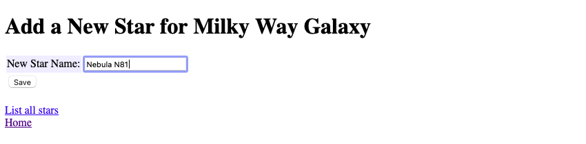

The _Add a New Star_ page works esentially the same as the _Add a New GalaxtY_ page. (See [_POST Add_ request using a _form_](#470fd552-7859-4aec-ae5c-89d4573a2d92)).

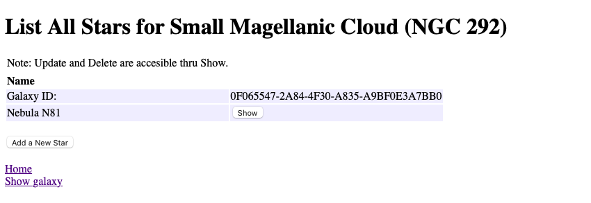

Look for the _Nebula N81_ in the Stars list.

[back to contents](#contents)<hr/>


<!--section-break-section-break-section-break-section-break-section-break-section-break-->


## <a id="c507e1d9-7ddf-41ab-bb64-fc22f3ee11a6">List All Stars Page</a>

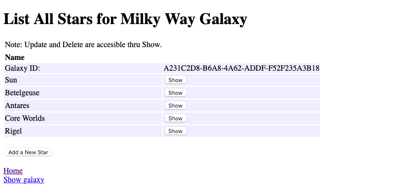

StarController follows the same basic pattern as GalaxyController, so there's no reason to go through it in the same detail. Most of the controllers you'll write for your app will resemble these, but with the variations that are needed for your specific tasks.

Here are the differences between _GalaxyController_ and _StarController_:

- One error message is different.
- The routes collection has only one _show_ (a button).
- The _index_, _show_, _add_, _save_, and _delete_ endpoints in the StarController require a StarIdContext, and the _update_ endpoint expects a StarContext. Both contexts require a _galaxy_id_, a _galaxyName_, and a _starId_. In the case of _add_ and _save_, the _starId_ is an empty string because it's unused in these two functions.
- The _index_ function uses a different query from the one in GalaxyController because here the galaxy and all of its stars are going to be retrieved all in one operation. More on that is below.

[back to contents](#contents)<hr/>


<!--section-break-section-break-section-break-section-break-section-break-section-break-->

### <a id="1c107f53-534b-4836-b1e4-129c1f0c9c36">How to Query a Galaxy and it's Stars</a>

The galaxy lookup in _GalaxyController's showGalaxy_ function to look up a single galaxy is a simple _find_ query:

```swift
GalaxyModel.find(galaxyId, on: req.db)
```

The galaxy lookup in _StarController's index_ uses a long-form galaxy query:

```swift
GalaxyModel.query(on: req.db).filter(\.$id == galaxyId).first()
```

Those two queries do the same thing, but the _find_ function is a nice shortcut. Each of them finds the galaxy whose primary key is _galaxyId_.

To add the stars, a _with(&nbsp;)_ is added. Yes, it's that simple.

```swift
GalaxyModel.query(on: req.db).with(\.$stars).filter(\.$id == galaxyId).first()
```

Notice that the _first(&nbsp;)_ function is used: it's because only one galaxy is being looked up; the stars just come along for the ride. When we unwrap the galaxy into _galaxy_, _galaxy.stars_ will have an array of _StarModels_ that we can use to create a StarsContext.

```swift
let starsContext = StarsContext(many: galaxy.stars, parent: galaxy)
```

[back to contents](#contents)<hr/>


<!--section-break-section-break-section-break-section-break-section-break-section-break-->

## <a id="1adfc405-a0e6-4d37-a7fd-62e24e9dd641">Show One Star</a>

When the _show_ button is clicked on the _List All Stars_ page, the _Show a Star_ page displays.


Notice that the _Galaxy ID_ (the galaxy's UUID) and the _Star ID_ (the star's UUID) are displayed here. These would never be displayed in a production app, but since this is a demonstration app, they're displayed here so you can see what they look like.

The _Update_ and _Delete_ stars buttons work like the corresponding galaxy buttons.

If the galaxy has no stars yet, this page displays:

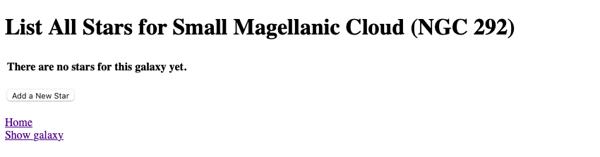

[back to contents](#contents)<hr/>


<!--section-break-section-break-section-break-section-break-section-break-section-break-->


## <a id="32db6b7a-ffd0-4de7-95f3-a824a739aef2">Testing</a>

### <a id="36973807-3365-43c1-8809-9eab1d4bbfdc">A Few Words About Testing</a>

Many developers recommend writing a test before writing the function being tested. When developing web apps with Swift+Vapor+Fluent+SwiftHtml, I find that writing the function first, then  writing the test works out better because when the outputs are complex, I'm not _exactly_ sure of what the result is going to look like until _after_ the function is "working."

This, for me, is a question of following the path of least resistance because clients usually ask for changes during at least a few of the early write-review-revise cycles anyway. If I want to test and see if I got the right page, I just examine the title returned from the test. After I see what's coming back from the endpoint, that's easier to do.

Following this path means tests exist to validate that the code still works after later fixes and modifications, as opposed to testing to see if the code performs as it was anticipated before writing the code. Too often developers make an insignificant change to fix something, test it manually, then commit the change without realizing that some other part of the code was affected and failed after the new version goes live. This is _exactly_ the situation all managers fear. The costs of managing the disastrous release far exceed the costs of writing good tests.

The tests here are incomplete because _Galaxy Revisited_ is a demonstration app and the tests included with it are designed to teach principles of writing tests so you can write them for your app.

The existing literature on writing Server Side Swift tests is inadequate, especially where testing of links and buttons is concerned, and _Galaxy Revisited_ hopes to provide new solutions for that.

> **Note**

> When calling the _test(.GET, url, ...)_ function, it will do you the favor of adding a "/" at the beginning of the URL if yours doesn't have one. The upshot is that if you have a bad link, i.e., one missing a "/" at the beginning, your tests will work fine, but your app will fail. It's my opinion that testing software should not magically fix your errors during tests in such a way as to make a test pass when the app will fail. You're welcome to your own opinion on this.

The approach I'm taking here is, given a known endpoint (_/galaxy/index_, for example), to attempt to retrieve the page first. If the page retrieval fails, stop the tests for this endpoint (page); otherwise, test links and buttons to see if they retrieve the pages they're linked to. Only one link of any given type gets tested, so if I retrieve a page with seven galaxies, only the first will be tested.

I could have written tests to see if the database is working, but that would be redundant because the endpoint tests use the database, and therefore, test it, too. Also, I didn't try to retrieve the records written by _add_ or _save_ directly from the database for the same reason.

_Galaxy Revisited_ doesn't have a bunch of testable helper methods, but I could have written tests for those if there were any.

### <a id="f4935ac8-21a6-4d23-ada2-2cdf507b6986">Testing Links and Buttons on a Page</a>

Once the page HTML is retrieved, the big problem is extracting the target link or button. To help with this, _ControllerTests_ extends _String_ with some helper functions:

- cleanHtml: this function is used to remove redundant whitespace and newlines.

- findRegex: this function searches for an embedded string and returns it; if none is found, it returns _nil_. If the string being searched for doesn't exist, or the wrong number of parameters is present, it adds an error message to the test results.

- findLink: this searches for an embedded _\<a name="...">...\</a>_ and returns the entire link.

- findHref: this searches for an embedded _href="..."_ and returns the contents of href.

- findForm: this searches for an embedded _\<form name="...">...\</form>_ and returns the entire form.

- findHidden: this searches for an embedded _\<input name="..."/>_ and returns the entire input.

- findValue: this searches for an embedded _value="..."_ and returns the contents of value.

- findButton: this searches for an embedded _\<button name="...">...\</button>_ and returns the entire button.

- findFormaction: this searches for an embedded _formaction="..."_ and returns the contents of formaction.

You can use these in your tests, too, Test them and discover how they work. You'll find them very useful.

_ControllerTests_ also has three functions that retrieve the pages, test the links, and test the buttons. Here are some examples, but look at the code to get a better idea of how they're used.

- retrievePageHtml: given a URL, this retrieves and returns the page HTML or nil. If a page is retrieved, it validates the page by looking for the validationString within the page. _Galaxy Revisited_ uses the page's title.

```swift
let galaxyIndexPageHtml =
try retrievePageHtml(
    app: app,
    url: "/galaxy/index",
    validationString: "<title>List All Galaxies</title>"
)
```

- testLink: given the page HTML and a link name, extract the link and pass the URL to retrievePageHtml. If the URL isn't valid, or the page doesn't validate, errors will be recorded in the log file.

```swift
try testLink(
    app,
    html: galaxyIndexPageHtml,
    name: "show-1-link",
    validationString: "<title>Show A Galaxy</title>"
)
```

- testButton: this works the same as _testLink_, except that it looks for a button.

```swift
try testButton(
    app,
    html: galaxyIndexPageHtml,
    formName: "show-3-form",
    submitName: "show-3-submit",
    hiddenInputs: ["galaxyId"],
    validationString: "<title>Show A Galaxy</title>",
    GalaxyIdContext()
)
```

[back to contents](#contents)<hr/>


<!--section-break-section-break-section-break-section-break-section-break-section-break-->
 

## <a id="3706d5ae-5b59-4465-b9c0-ab729a518055">Universally Unique Identifiers (UUIDs)</a>

UUIDs in Fluent are used by a record in one table to link to a record in another table. Depending on how these links are used, different relationships can be created. In a database, these UUIDs _**must never**_ be changed or relationships will be broken. In _Galaxy Revisited_, when the database is re-created, either manually or during a test, all the tables are discarded, re-created, and re-loaded. All the relationships are re-created correctly, but with new UUIDs, meaning that you can't depend on them to be the same as they were previously. You would never re-create UUIDs in a real application.

Also, UUIDs are never displayed to users, except maybe for diagnostic purposes. Instead, you display the name of the data the UUID represents, i.e., you wouldn't display the UUID (like 4ac343ac-7226-491e-a998-6fe3f11b7b3d) of a galaxy record, but the name of the galaxy (Milky Way).

In _Galaxy Revisited_, the _show_ pages display the UUID for diagnostic purposes because this is a demonstration application, not a production application.

[back to contents](#contents)<hr/>


<!--section-break-section-break-section-break-section-break-section-break-section-break-->


## <a id="0537ec6b-30bf-4d3d-a84b-6492e321461b">Data Transfer Objects (DTOs)</a>
A Closer Look At _**Data Transfer Objects**_

A _Data Transfer Object_ is, in its simplest form, just a struct with little if any functionality of its own. Say, for example, that you have a model, **GalaxyModel**, and you use it to read a **Galaxy** record from the database, and now you want to call another function with that **Galaxy** record. The **Galaxy** can be copied to another struct, say **GalaxyContext**, which can then be used to call the next function. We use the terminology Data Transfer Object to refer to that simple struct.

"Wait a minute," you say, "I can just pass the model because the **GalaxyModel** struct is the same as the proposed **GalaxyContext** struct." The response to that is, "Yes, you could do that, but there are advantages to using the **GalaxyContext** to pass the **Galaxy** to the other function."

Here's why we use DTOs:

- If we pass GalaxyModel to our other function, we may also be passing the capabilities that a GalaxyModel has: namely, reading and writing the database in this case. Passing that kind of capability to actors that don't need it represents a security risk. By copying the Galaxy from the GalaxyModel to the GalaxyContext, we create a structure that doesn't carry additional unnecessary functionality to the next function. Since GalaxyContext will be immutable, it's also safe from accidental modification or modification by hacking.

- If we're passing a lot of data out of the current scope, the data in a DTO can be compressed for transmission. This was, in fact, the original idea behind DTOs. Other people recognized the advantages DTOs have for other applications later.
  - Additional context not in the Galaxy record can be added, such as the time it was retrieved and other related data.
  - The DTO can contain limited functionality to convert data formats if needed, and the compression functions can also be part of the DTO. A simple example of this is, a UUID? found in the Galaxy record can be converted to a pure String when setting, or from a String to a UUID when getting.
  - When we share a DTO instead of a model with a template in the _Galaxy Revisited_ project, we don't accidentally expose data like passwords or other sensitive information.
  - Lastly, in _Vapor_, contexts are used to encode and decode data between pages. The benefit of this is that the compiler can validate them.

[back to contents](#contents)<hr/>


<!--section-break-section-break-section-break-section-break-section-break-section-break-->


## <a id="45bf0627-8fc0-4291-8f78-0e8a6dc5b15e">Run Galaxy Revisited on an Amazon Linux 2 Server</a>

This guide is for the reader who has never used Amazon Web Services (AWS) before and just wants to get started learning Server Side Swift. It goes through the process of setting up a web server with only an administrator (who has root privileges) and _no_ users.

The next step, setting up users and assigning them privileges using [IAM](https://docs.aws.amazon.com/IAM/latest/UserGuide/introduction.html) is left as an exercise for the reader.

Keep in mind that the server's root user will have `sudo` privileges, including `sudo -i` which signs on as root. As such, while this account may be used for learning Server Side Swift, if you want to put your work into production on this server, you'll need to use [IAM](https://docs.aws.amazon.com/IAM/latest/UserGuide/introduction.html) to create user accounts that don't have root privileges.

So, let's get started.

### <a id="51fd8a5e-8260-4f98-8f16-ee5eae59b647">Start at the Lightsail page</a>

- Go to the [Lightsail sign-in page](https://lightsail.aws.amazon.com/).


- Click `Create a new AWS account` and follow the instructions to create your AWS account. This will be your _permanent_ AWS account login that you'll use for all AWS services, so keep the email address and password in a safe place.

Once you have an AWS account:

- Enter your AWS root user mail address (the one you used to create your AWS account above) and sign in.
- If you are asked to do so, complete the "Security Check" (Captcha).
- This will take you to your "Home" page.

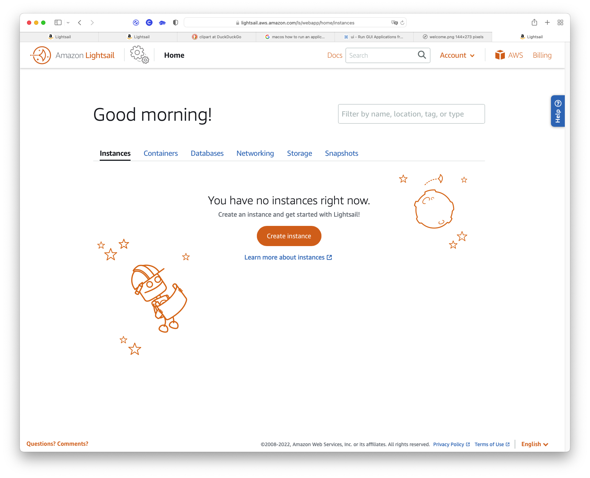

#### <a id="5f61da11-cc42-4918-b52d-a190506d6899">At the `Home` page, click the `Create Instance` button.</a>


- At "Instance location," choose the server you want to have your instance on.
- At "Select a platform," choose `Linux/Unix`.
- At "Select a blueprint," choose `OS Only`.
- After the page refreshes, choose `Amazon Linux 2`.

#### <a id="25500332-0d24-406d-b566-e5c4bfe9bb21">Creating Keys</a>

- Scroll down to "SSH key pair manager," click `Change SSH key pair`, and the "SSH key pair manager" will open up.

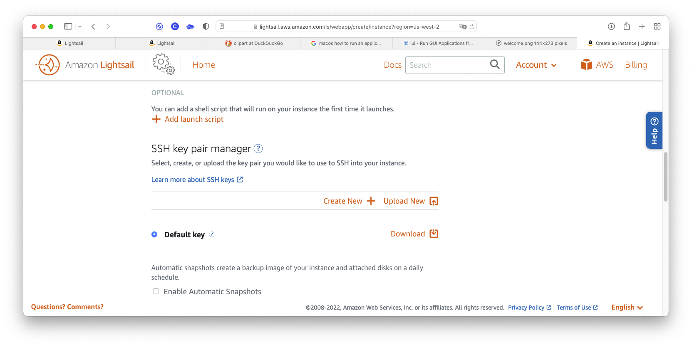

> A little note here:  
  The "Default key" will only work for the Amazon browser-based console. This console is the one you'll use for emergencies if any. For logging in from a Linux or macOS "terminal" window, and for setting up an "sshfs" folder later, you'll need to create another key pair for remote access. Also, create only one (1) key here.
    
Note also that the client (you) retains the `private` key, and the server (AWS) retains only the `public` key. That's why, after generation, the private key can only be downloaded once, and why AWS doesn't remember it. It's a security precaution that guarantees only you have the private key.
    
- Click the `Create new +` link.


- Click the `Create` button to dismiss the dialog window.


Choose a unique name for the new key: I recommend using one that relates to the name you'll choose for the AWS instance: for example, "chicago-office-west" for "ChicagoOfficeWest" we'll use below. You'll be prompted to download the secret part of the key, and you only get ONE (1) chance. It'll go to your Downloads folder, and we'll move it later. It'll be named \<your-key-pair-name\>.pem (~/Downloads/chicago-office-west.pem in this example).

> Be careful not to lose this key! You can only create one (1) root login for an instance. To create user logins later, refer to the [IAM User's Guide](https://docs.aws.amazon.com/IAM/latest/UserGuide/introduction.html).
    


After your key is downloaded (to your Downloads folder), you'll go back to the "SSH key pair manager" page.

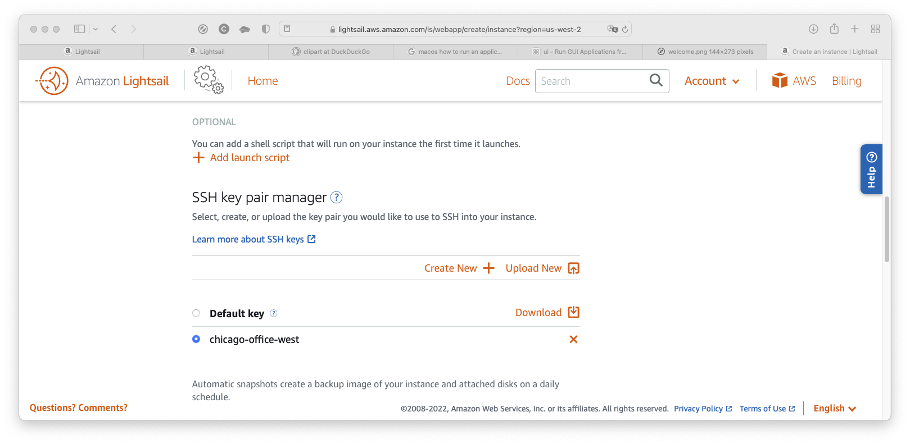

You'll see your newly created key here. The "chicago-office-west" in the list refers both to the _public_ key that AWS keeps, and the _private_ key that you keep.


That _private_ key is here in your Downloads folder. Don't worry about it being there. We'll move it soon.

#### <a id="b8668941-f36e-437f-ab18-e97b04dc2a5c">Choosing a Plan</a>


- Under "Choose your instance plan," select whichever one you prefer. If you want to just create one for the duration of studying this book, I recommend the $10 plan (this is the smallest plan that will work with GalaxyRevisited). If you plan to keep the instance after studying this book, pick a plan that's right for your needs.
- Under "Identify your instance," create a name that describes the site you're creating: for example, "ChicagoOfficeWest," or "JohnHancocksBlog." If you plan on having more than one AWS server in the future, be sure you select a name carefully: you can only have one instance per unique name.
- Leave the "x" as 1, and ignore the tagging options.
- Click the `Create instance` button.

#### <a id="9b964e3b-8df9-494f-96ac-71ce90b249ed">Your Instance Is Up And Running</a>

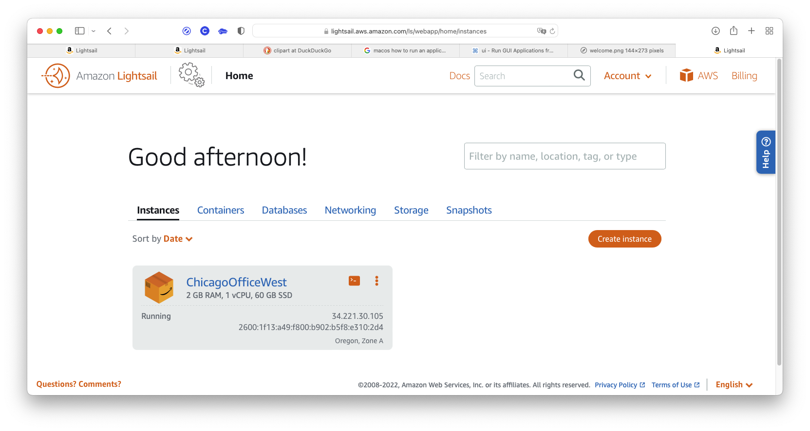

Your server creation is complete and your server is up and running.

This is the "Home" page the way it will appear whenever you log into your AWS server.

#### <a id="b48ec3e7-fa28-4619-b771-1a63a4310afd">Creating a Static IP Address</a>

The next thing we need to do is create a static IP address for the instance. Otherwise, there could be problems if the dynamic IP were to change once in a while.

- Select the "Networking" tab to do this.


- Click the `Create static IP` button.


At "Static IP location," you'll usually see the location where your server is running. Normally, you won't change this.

- At "Attach to an instance," pick yours (ChicagoOfficeWest in this tutorial).
- Under "Identify your static IP," enter a more meaningful name for it (chicago-office-west-ip to match the server name in this example).
- Click the `Create` button to create the static IP.

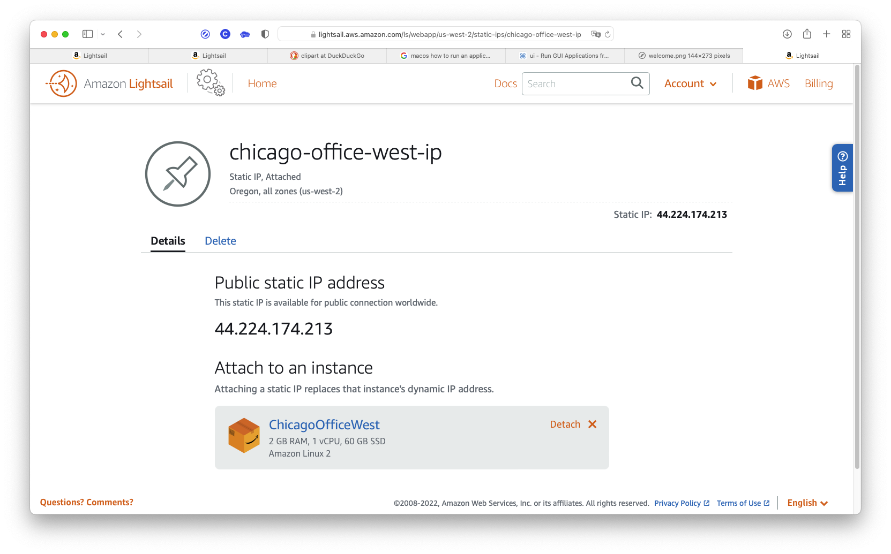

#### <a id="fa96c869-b543-4e18-8cc9-d647868b86f2">Examining The New Instance</a>

- Click the `Home` button to go back to your home page.

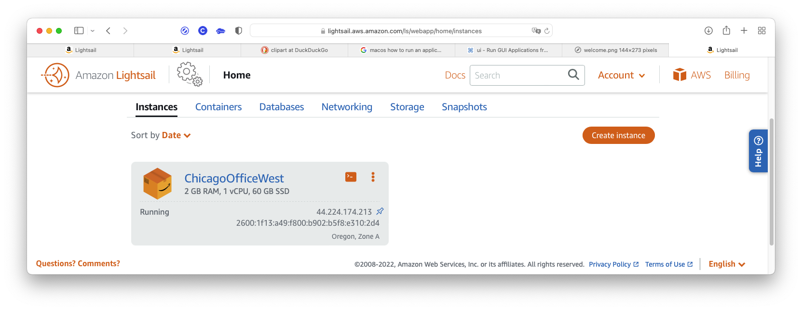

- Click the name of your instance (ChicagoOfficeWest in this example), or ...

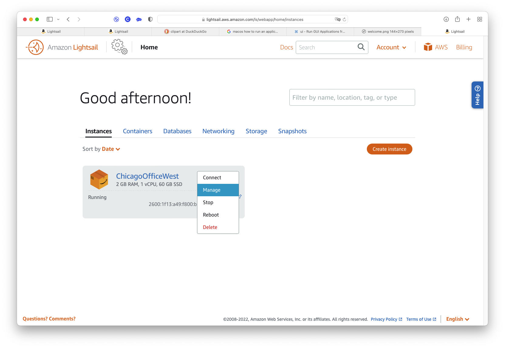

... click the `More` menu (three vertical dots at the top-right of the instance), and select `Manage`.


Here you see your instance and the IP addresses associated with it. The "Connect using SSH" button brings up Amazon's in-browser terminal window. This terminal is good for many things, but generally inadequate for developers (you can't copy text from the window, for example). This is the browser you'll use if something goes drastically wrong, and you need to get back into your instance to fix things.

Don't worry about the section labeled "Use your SSH client." I'll show you how to do that soon.

> Wait! What's that other "Private IP" address in the upper right-hand corner? That's an address you can use to communicate between multiple instances at AWS ( if you have more than one, and they need to communicate).

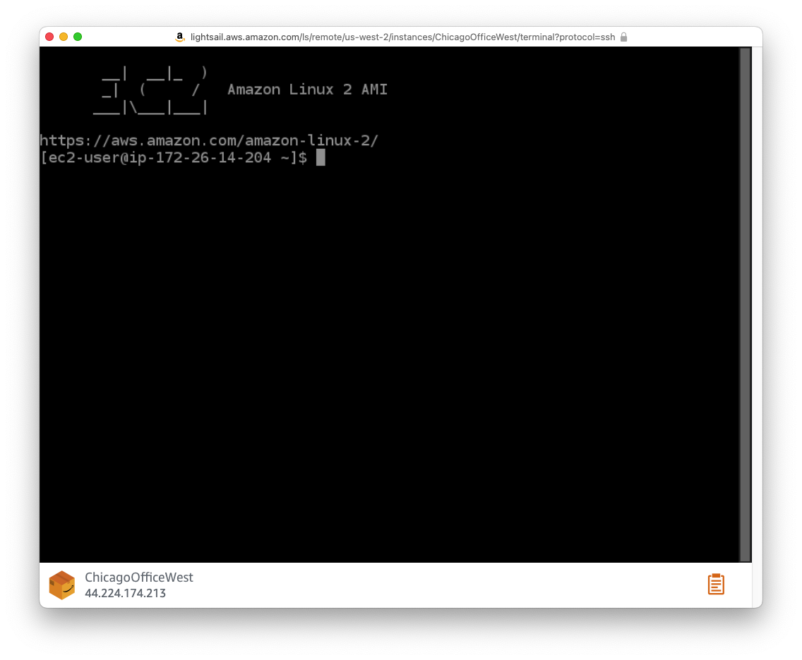

#### <a id="51728c3d-b4f8-4d6a-959d-ce7bacc582eb">Setting up the client (your computer's terminal and sshfs)</a>

First, you have to move the private key you created to a safe place, usually ~/.ssh, then change its protections, and lastly, you can log in. Let's look at how this is done.

In the examples below, replace "chicago-office-west.pem" with your secret key's name, and replace 44.224.174.213 with your instance's public IP address.

- Open a terminal window.
- Move the secret key using `mv ~/Downloads/chicago-office-west.pem ~/.ssh`.
- Change the protections with `chmod 400 ~/.ssh/chicago-office-west.pem` or SSH won't connect (a security feature),
- Start SSH with `ssh -i ~/.ssh/chicago-office-west.pem ec2-user@44.224.174.213`. The `-i` option tells SSH what key to use. AWS won't use the default key ("id_rsa.pub"). That's why we needed to create a key pair. Answer "yes" to the fingerprint question.
- To get out of the server, use `exit`.

I know, it's all starting to fall into place now. Who would have guessed all this?

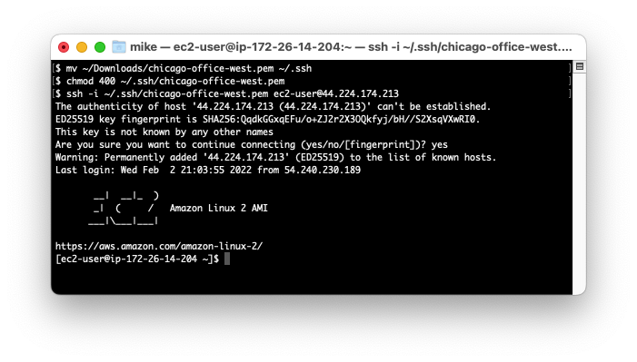

And we're in! Just to see if it's working, we'll create a test file.


- Just copy the commands you see above to create and check the test file.


And if you have `sshfs` installed (how to do this is beyond the scope of this document), you can use the commands above. (If you have macOS, just use _Cyberduck_.)


> IMPORTANT NOTE  \
Your "root" user login is not recommended for production use. For setting up working logins, you should use [IAM](https://docs.aws.amazon.com/IAM/latest/UserGuide/introduction.html). Setting up IAM is beyond the scope of this guide.

### <a id="8bc06efc-2f30-425b-a65a-43ed44cb4add">MySQL 8 Database Server</a>

To install MySQL, there's [a good article on TechView](https://techviewleo.com/how-to-install-mysql-8-on-amazon-linux-2/).

I'm going to summarize what we need from that article below.

#### <a id="8d84d5a7-4f39-406d-a102-fe49d12a73bd">Start by checking the release of your EC-2 instance</a>

You can check the release of your server by running the following command in the terminal. Amazon Linux is a derivative of CentOS 7 Linux server with a few extra repositories and packages for improved performance and integrations with other AWS cloud services. You can check the release of your server by running the following command in the terminal.

```script
$ cat /etc/os-release
NAME="Amazon Linux"
VERSION="2"
ID="amzn"
ID_LIKE="centos rhel fedora"
VERSION_ID="2"
PRETTY_NAME="Amazon Linux 2"
ANSI_COLOR="0;33"
CPE_NAME="cpe:2.3:o:amazon:amazon_linux:2"
HOME_URL="https://amazonlinux.com/"
```

#### <a id="b7d5f596-df05-44d2-9e0a-65712e00c965">Install the repository</a>

Add _MySQL yum repository_ to Amazon Linux 2.

```script
$ sudo yum install https://dev.mysql.com/get/mysql80-community-release-el7-5.noarch.rpm
```

You can also view a list of configured repositories with the yum command.

```script
$ sudo yum repolist
repo id                                   repo name                              status
amzn2-core/2/x86_64                       Amazon Linux 2 core repository         27418
amzn2extra-docker/2/x86_64                Amazon Extras repo for docker          56
mysql-connectors-community/x86_64         MySQL Connectors Community             181+49
mysql-tools-community/x86_64              MySQL Tools Community                  138
mysql80-community/x86_64                  MySQL 8.0 Community Server             321
repolist: 28114
```

The installation should display _Complete!_ if all goes as planned.

A new repository file should have been created inside the /etc/yum.repos.d directory

```script
$ ls /etc/yum.repos.d
amzn2-core.repo  amzn2-extras.repo  mysql-community.repo  mysql-community-source.repo
```

#### <a id="ceaac5ea-c0a3-4e57-aaa8-3bd2bec6867f">Install the MySQL package and start the server</a>

Once the repository has been added, install MySQL 8 server packages on Amazon Linux 2.

```script
sudo amazon-linux-extras install epel -y
sudo yum -y install mysql-community-server
```

This install should also display _Complete!_ if all goes as planned. The next step is to start MySQL server services.

```script
sudo systemctl enable --now mysqld
```

Confirm that MySQL server service is started and running.

```script
$ systemctl status mysqld
● mysqld.service - MySQL Server
   Loaded: loaded (/usr/lib/systemd/system/mysqld.service; enabled; vendor preset: disabled)
   Active: active (running) since Thu 2022-10-27 04:48:11 UTC; 15h ago
     Docs: man:mysqld(8)
           http://dev.mysql.com/doc/refman/en/using-systemd.html
 Main PID: 4677 (mysqld)
   Status: "Server is operational"
   CGroup: /system.slice/mysqld.service
           └─4677 /usr/sbin/mysqld

Oct 27 04:48:04 ip-172-26-0-5.us-west-2.compute.internal systemd[1]: Starting MySQL Server...
Oct 27 04:48:11 ip-172-26-0-5.us-west-2.compute.internal systemd[1]: Started MySQL Server.
```

#### <a id="02eab657-2444-42c5-9ff8-82e54f662a86">Change the new root password and add a user password for Galaxy Revisited</a>

A superuser account _'root’@’localhost'_ is created with an initial password set and stored in the error log file. To reveal it, use the following command:

```script
$ sudo grep 'temporary password' /var/log/mysqld.log
2020-08-12T17:25:34.992227Z 6 [Note] [MY-010454] [Server] A temporary password is generated for root@localhost: BEw-U?DV,7eO
```

Use this initial password to harden the server.

```script
$ sudo mysql_secure_installation -p
Enter password: <INPUT-PRINTED-PASSWORD> # BEw-U?DV,7eO in this example
```

Set a new, strong password for MySQL root: let's use 3gU537vhnX00.

```script
The existing password for the user account root has expired. Please set a new password.
New password: 3gU537vhnX00
Re-enter new password: 3gU537vhnX00
```

Continue to answer the questions according to your use case and preferences.

```script
Remove anonymous users? (Press y|Y for Yes, any other key for No) : y
Disallow root login remotely? (Press y|Y for Yes, any other key for No) : y
Remove test database and access to it? (Press y|Y for Yes, any other key for No) : y
Reload privilege tables now? (Press y|Y for Yes, any other key for No) : y
```

The database for Galaxy Revisited is more easily created now since we're already here. Create a user named _coco_ and use a password _Milky-1-Way_. This will match the values in _Sources/App/configure.swift_.


outside of the app itself, since we're already executing commands in the database.

```script
create user coco identified by 'Milky-1-Way';
grant all privileges on galaxies.* to coco;
create database galaxies;
```

```script
$ mysql -uroot -p mysql
Enter password: 3gU537vhnX00
...
Server version: 8.0.31 MySQL Community Server - GPL
...
mysql> create user coco identified by 'Milky-1-Way';
Query OK, 0 rows affected (0.01 sec)

mysql> grant all privileges on galaxies.* to coco;
Query OK, 0 rows affected (0.01 sec)

mysql> create database galaxies;
Query OK, 1 row affected (0.01 sec)

mysql> quit
Bye
$
```

### <a id="15a71478-a6e2-404c-9f88-1796360f6785">Installing Swift</a>

#### <a id="a43c71aa-1b5c-44b9-bfe1-998260572227">Downloading Swift</a>

Open the download releases webpage in your browser from [here](https://swift.org/download/#releases). Under `Platform`, right-click the `Amazon Linux 2` link and choose `Copy Link`. Download the compressed release file onto your server using curl or wget (wget is used in the example).

```shell
# wget <the link from the download releases page>

# example:
wget https://download.swift.org/swift-5.7-release/amazonlinux2/swift-5.7-RELEASE/swift-5.7-RELEASE-amazonlinux2.tar.gz
```

For instructions on how to use `wget` to check the *signature* of the downloaded file, refer back to the Swift download page.

When the download is complete, you'll get a message something like `2022-01-30 19:27:14 (5.46 MB/s) - ‘swift-5.7-RELEASE-amazonlinux2.tar.gz’ saved [579258668/579258668]`.

You'll need to know the **tar-filename** (`swift-5.7-RELEASE-amazonlinux2.tar.gz` in this example) in the next step. You can also just use `ls` to get the filename.

#### <a id="56bf8150-65e2-4d41-832a-f015d735923e">Finishing the Install</a>

You can now extract the downloaded archive using the **tar** command. This also can take a little time:

```shell
# untar the downloaded archive using:
# tar xzf <tar-filename>

# example:
tar -xzf swift-5.7-RELEASE-amazonlinux2.tar.gz
```

This creates an **extracted-folder** `<VERSION><PLATFORM>` in the same place as your archive (`swift-5.7-RELEASE-amazonlinux2` in this example).

The last step is to export the location of the binary. The **full pathname** followed by **/usr/bin** is needed here. We need to put this into the Bash Profile so it'll load the next time you log in:

```shell
## add the PATH command to the Bash Profile
# echo 'export PATH="<extracted-folder-full-pathname>/usr/bin:${PATH}"' >> ~/.bash_profile
## reload the Bash Profile
# source .bash_profile

# example:
echo 'export PATH="$HOME/swift-5.7-RELEASE-amazonlinux2/usr/bin:${PATH}"' >> ~/.bash_profile
source .bash_profile
```

#### <a id="4e5e5b2a-bce6-46cd-96bc-dfae42761300">Verifying Swift version</a>

Now you should be able to use Swift on either Mac or Linux. You can verify the installation by entering the following into the command line:

```shell
swift --version

# displays:
# swift-driver version: 1.26.21 Apple Swift version 5.7 (swiftlang-1300.0.47.5 clang-1300.0.29.30)
# Target: arm64-apple-macosx12.0
```

And you can optionally remove the tar archive (you'll probably never need it again, but it can always be re-downloaded if needed):

```shell
# rm <tar-filename>

# example:
rm swift-5.7-RELEASE-amazonlinux2.tar.gz
```


### <a id="5c86b8d2-6bb8-4ca3-a126-28b7d017e411">Installing Swift Package Manager</a>

That was pretty easy, and now I'd like to show you one more tool since it's a cross-platform solution to manage Swift versions on your operating system.

#### <a id="ef70d3d4-3e4a-4297-8e6e-fe6c883ef85b">Installing Dependancies</a>

Before installing Swift Package Manager (SPM), we must install the required dependencies. 

```shell
# e.g. Swift dependencies on Amazon Linux 2 (install as root using sudo).
# For other distributions, refer back to the Swift download page.

sudo amazon-linux-extras install epel
sudo yum install \
   binutils \
   gcc \
   git \
   glibc-static \
   gzip \
   libbsd \
   libcurl \
   libedit \
   libicu \
   libstdc++-static \
   libuuid \
   libxml2 \
   zlib-devel \
   tar \
   tzdata
```

Swift Version Manager (also called swiftenv) allows you to easily install and switch between multiple versions of Swift. It can be [installed](https://swiftenv.fuller.li/en/latest/installation.html) on both platforms, you just have to clone it:

```shell
git clone https://github.com/kylef/swiftenv.git ~/.swiftenv
```

The next step is to configure the environment.

If you're using Linux, the default shell is probably Bash, as it is with Amazon Linux 2. You can enter the following commands to set up the environment for swiftenv: 

```shell
echo 'export SWIFTENV_ROOT="$HOME/.swiftenv"' >> ~/.bash_profile
echo 'export PATH="$SWIFTENV_ROOT/bin:$PATH"' >> ~/.bash_profile
echo 'eval "$(swiftenv init -)"' >> ~/.bash_profile	
source .bash_profile
```

Now you can list all the available Swift language versions:

```shell
swiftenv install --list
```

Run this command to install a specific Swift version:

```shell
# swiftenv install <version>

# Example:
swiftenv install 5.7
```

### <a id="5d492dd9-54b0-48ea-9005-6df5cbdda58b">Cloning Galaxy Revisited from GitHub</a>

To get the _Galaxy Revisited_ project, just clone it from GitHub as follows:

```script
$ git clone https://github.com/mjwelchphd/GalaxyRevisited.git
Cloning into 'GalaxyRevisited'...
remote: Enumerating objects: 182, done.
...
Resolving deltas: 100% (47/47), done.
$
```

Next, _cd_ into the _Galaxy Revisited_ project and build it:

```script
$ cd GalaxyRevisited
$ ls
docker-compose.yml  Dockerfile  LICENSE  Package.resolved  Package.swift  Public  README.md  Resources  Sources  Tests
$ swift build
Fetching https://github.com/vapor/async-kit.git from cache
Fetched https://github.com/vapor/async-kit.git (0.48s)
...
Creating working copy for https://github.com/vapor/fluent-mysql-driver
Working copy of https://github.com/vapor/fluent-mysql-driver resolved at 4.1.0
Building for debugging...
[2323/2323] Linking Run
Build complete! (343.14s)
$
```

#### <a id="7f8f8ca4-2ebd-4a11-ab18-6e8a89ccd0f0">Building and Running</a>

You can build and run it using the Linux command line:

```shell
$ swift run &
```

The terminal shows this:

```script
[1] 6534
Building for debugging...
Build complete! (0.35s)
[ NOTICE ] Server starting on http://127.0.0.1:8080
```

The line "[1] 6534" says that the app is running as background job 1, and the PID is 6534.

A \<return> will show the $ prompt again.

The run command builds the package first, then executes the Galaxy Revisited project _in the background_ (that's what the ampersand at the end of the command means). It'll take some time to build everything the first time you build, but after the first time, only sources that change will need to be rebuilt, and builds will go fast.

Alternatively, you can build the app first, then run it from the build folder by hand:

```shell
$ swift build
```

The terminal shows this:

```script
Building for debugging...
Build complete! (0.35s)
$
```

And to run:

```script
$ swift run &
```

To test if your application is working, use curl in the foreground:

```script
$ curl localhost:8080
```

You'll see a bunch of HTML starting with _\<!DOCTYPE html>_

To stop the server, bring it to the foreground, then use \<ctrl-C>.

```script
$ fg %1
swift run GalaxyRevisited <-- Server response
^C
$ jobs
$ 
```

Notice that the `jobs` command produces no response because we stopped the server (which validates that we _did_ stop the server).

> Note  
> If you try to repeat the build first without stopping an app that's running on port 8080, you'll get a lengthy error with <span style="color: red;">... Address already in use (errno: 98) ...</span> in it.

#### <a id="040b70f9-1910-43ec-b622-5cf79890c84f">Accessing From A Browser</a>

If you have Galaxy Revisited running on a local Linux or macOS computer that has a browser, visit http://localhost:8080/ in your browser. You should see the Hello Vapor! message.

If the build completed, try running the app. It should look like this:

```script
[ INFO ] [Migrator] Starting prepare [database-id: mysql, migration: App.CreateGalaxy]
[ INFO ] [Migrator] Finished prepare [database-id: mysql, migration: App.CreateGalaxy]
[ INFO ] [Migrator] Starting prepare [database-id: mysql, migration: App.CreateStar]
[ INFO ] [Migrator] Finished prepare [database-id: mysql, migration: App.CreateStar]
[ NOTICE ] Server starting on http://127.0.0.1:8080
```

To stop it, use \<ctrl>C.

#### <a id="a3e7dac7-6273-4c78-948a-320a95f48a66">Updating Galaxy Revisited on AWS After Initial Installation</a>

You can check for updates as follows. If there are updates, they will be installed into the project.

```script
$ git pull
remote: Enumerating objects: 21, done.
remote: Counting objects: 100% (21/21), done.
remote: Compressing objects: 100% (5/5), done.
remote: Total 11 (delta 5), reused 11 (delta 5), pack-reused 0
Unpacking objects: 100% (11/11), 2.89 KiB | 269.00 KiB/s, done.
From https://github.com/mjwelchphd/GalaxyRevisited
   0493f1c..7cfb57a  main       -> origin/main
Updating 0493f1c..7cfb57a
Fast-forward
 Public/README.html                                        | 90 +++...---
 README.md                                                 | 97 +++...---
 Sources/App/Modules/Star/Controllers/StarController.swift |  1 +
 3 files changed, 154 insertions(+), 34 deletions(-)
$ 
```

If there are no updates, you just get a message:

```script
Already up to date.
$ 
```

You can check updates you've made with this:

```script
$ git status
```

If there are no updates, you'll get:

```script
On branch main
Your branch is up to date with 'origin/main'.

nothing to commit, working tree clean
$
```

Otherwise, the updates will be listed:

```script
On branch main
Your branch is up to date with 'origin/main'.

Changes not staged for commit:
  (use "git add <file>..." to update what will be committed)
  (use "git restore <file>..." to discard changes in working directory)
      modified:   Sources/App/Modules/Star/Controllers/StarController.swift

no changes added to commit (use "git add" and/or "git commit -a")
$ 
```

If you modify something which has a modification at the origin, you'll be asked to merge the updates together when you execute a _git pull_. It's beyond the scope of this document to explain how that is done.

[back to contents](#contents)<hr/>


<!--section-break-section-break-section-break-section-break-section-break-section-break-->


### <a id="084799b1-400d-4b79-bf89-a2d5ced10c3f">Installing Nginx</a>

> NGINX (pronounced "engine-X") is open-source software for web serving, reverse proxying, caching, load balancing, media streaming, and more. It started as a web server designed for maximum performance and stability. In addition to its HTTP server capabilities, NGINX can also function as a proxy server for email (IMAP, POP3, and SMTP) and a reverse proxy and load balancer for HTTP, TCP, and UDP servers. --- [https://www.nginx.com/resources/glossary/nginx/](https://www.nginx.com/resources/glossary/nginx/)

Vapor will serve pages on port 8080, but you can't see port 8080 from outside your machine environment. To see what your pages look like in a browser, you need a _reverse proxy web server_. Nginx is the fastest web server available and is used on over 400 million web servers in the world. We'll use it to see our private port 8080 at the public port 80. Nginx also provides other valuable services, but the full capability of Nginx is beyond the scope of this document.

So, let's install Nginx!

First, we're going to enable **Extra Packages for Enterprise Linux** (EPEL), a set of additional packages for [RedHat-based Linux](https://www.redhat.com/en/blog/whats-epel-and-how-do-i-use-it/) (like Amazon Linux 2). Use the commands below, and answer **Y** when prompted.

```script
sudo amazon-linux-extras enable epel
sudo yum install epel-release
```

You should see the "Complete!" message at the end. Now we're ready to install `Nginx` itself. We're going to install it from the AWS repository, so we won't get the latest version; the tradeoff is that it'll be easier for now, and it's perfectly adequate for our needs. Use the commands below and answer **Y** when prompted (you'll be asked twice).

```script
sudo yum install nginx
```

To test your install, see the version, and start the actual Nginx server, use

```script
nginx -v
sudo systemctl restart nginx.service
```

Look at your server with your browser (and remember to use HTTP, not HTTPS) by entering `http://<your-aws-address>/` and you should see the Nginx startup page.

Next, we want to configure Nginx to forward our Vapor server to the open Internet. The configuration file we're going to create is in `/etc`, so I suggest creating it with

```script
sudo nano /etc/nginx/conf.d/proxy.conf
```

and entering the text below:

```script
server {
    listen 80;
    location / {
        proxy_pass http://localhost:8080/;
    }
}
```

Save the file with \<ctrl>O and \<return\>, and \<ctrl>X to get out.

Now we can restart Nginx with

```script
sudo systemctl restart nginx
```

Now, start Galaxy Revisited again.

```script
swift run
```

You should see:

```script
[0/0] Build complete!
[ NOTICE ] Server starting on http://127.0.0.1:8080
```

> Note: Our Vapor project still runs on port 8080, and Nginx passes port 8080 both ways to and from port 80. This isolates Vapor from the client at one more level, and it means Vapor doesn't have to implement TLS: that's done by Nginx (but we didn't set it up here).

Now enter `http://<your-aws-address>/` into your browser, and you should get: 

If you're using Xcode and the project's on your local machine, enter `http://<your-aws-address>/` in your browser and you should see the "Hi there, welcome to my page!" shown above.

Now enter `http://<your-aws-address>/hello` in your browser and see what you get. (You should get "Hello, World!")

Now your EC2 instance is a full-fledged Internet web server, and with Nginx, it'll be much easier to test it to see if everything is as you expect it to be.

> **Warning**: You'll probably see your app reporting requests when you're running your `myProject`, but didn't do anything with your browser. There're thousands of hackers trying to find websites to break into from countries all around the globe. They're active 24/7 and they **will** find your `myProject` running and try to break into it (if you leave it running for a while). That's what you'll see. For now, there's nothing for them here, so ignore them. In future chapters, you'll learn how to protect your Swift website against hackers.

[back to contents](#contents)<hr/>


<!--section-break-section-break-section-break-section-break-section-break-section-break-->


### <a id="150500ab-3243-4a27-9526-61b157769741">Running Galaxy Revisited As A Daemon</a>

To run the server continuously, you need to run it as a _daemon_, a task monitored by the system. If Galaxy Revisited stops for any reason, it'll be automatically re-spawned.

To do this, first, you need a _service_ file. Create (or edit) it like this:

```script
sudo nano /lib/systemd/system/galaxy.service
```

And put this in it:

```script
[Unit]
Description=Galaxy server daemon

[Service]
User=ec2-user
Group=ec2-user
WorkingDirectory=/home/ec2-user/GalaxyRevisited
ExecStart=/home/ec2-user/GalaxyRevisited/.build/debug/Run
Restart=always

[Install]
WantedBy=multi-user.target
```

Change its permissions, reload the daemons (including this one), and enable it like this:

```script
chmod +x /lib/systemd/system/galaxy.service
systemctl daemon-reload
systemctl enable galaxy.service
```

Now you can start or stop Galaxy Revisited as a daemon like this:

```script
sudo systemctl start galaxy
sudo systemctl stop galaxy
systemctl -l status galaxy
```

> Remember then Nginx is controlled separately, and both must be running to test. Normally, Nginx is always running, and if you don't do anything to it, it will just run. But you can either run Galaxy Revisited using the _swift run_ command when you're working on it, or as a daemon when you just want to leave it running.

<center>--- Fin ---</center>
